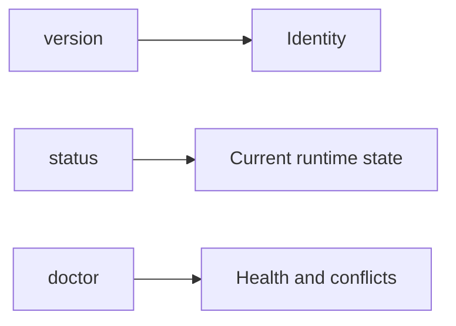
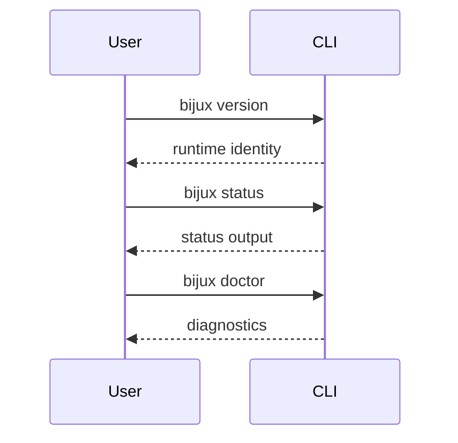

# Everyday Commands

## Goal

Use a small set of commands that answer the most common daily questions: what
version am I running, what grade does the runtime currently report, and what
command surface is available right now?



This diagram groups the daily commands by question. `version` answers identity,
`status` answers current runtime state, and `doctor` answers whether the
environment or install surface still needs attention.



The sequence diagram shows the normal order of use in a shell session: confirm
which runtime you are invoking, inspect the runtime state, then ask for deeper
diagnostics only if you need them.

## Core Commands

```bash
bijux version
bijux --help
bijux status
bijux doctor
bijux cli paths
```

## Script-Safe Status Check

For automation, use explicit machine-readable output:

```bash
bijux status --format json --no-pretty
```

Expected result:

- valid JSON
- exit code `0` on success
- no styling noise mixed into the payload

Scripts should pair structured output with exit-code checks rather than parsing
human-readable text.

## Script-Safe Version Check

When you need the runtime identity in automation, prefer the structured version
surface:

```bash
bijux version --format json --no-pretty
```

The JSON payload includes:

- `name`
- `version`
- `semver`
- `source`
- `git_commit`
- `git_dirty`
- `build_profile`

## When To Use Each One

- `version` when you need to know which runtime you are actually invoking
- `--help` when you need to inspect the current command surface
- `status` for a lightweight runtime snapshot
- `doctor` when you suspect install or environment problems
- `cli paths` when you need to know which binary and state directories are in
  play

## Honest Limit

None of these commands replace the reference docs. They are operational checks,
not a complete interface contract.

## Read Next

Continue to [Configuration And Output](configuration-and-output.md).
