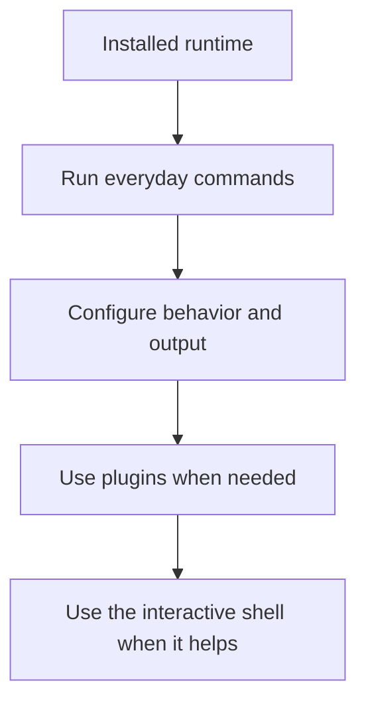
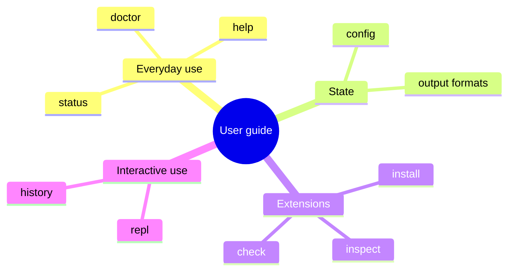

# User Guide

## Purpose

This section is the main user-facing guide once the runtime is installed and
verified. It explains the workflows people actually perform with `bijux`, not
the internal implementation or maintainer review process.

This flowchart shows the intended order for practical use: learn the everyday
checks first, then control configuration and output, then add plugins, and only
after that reach for the REPL when interactive work is genuinely faster.

The mindmap summarizes the same territory by theme. It helps readers jump to
the right guide depending on whether their question is about daily operation,
state and output, extensions, or interactive use.

## Read This Set In Order

1. [Everyday Commands](everyday-commands.md)
2. [Configuration And Output](configuration-and-output.md)
3. [Plugins And Extensions](plugins-and-extensions.md)
4. [Interactive Shell And History](interactive-shell-and-history.md)

## Scope

These pages are intentionally practical:

- they describe the workflows users can rely on today
- they avoid repeating architecture and contract material
- they are narrower than the full reference pages

## Next Step

If you are still validating the runtime, go back to
[Getting Started](../02-getting-started/index.md). If you need the exhaustive
command inventory, use the [Command surface](../06-reference/command-surface.md).
