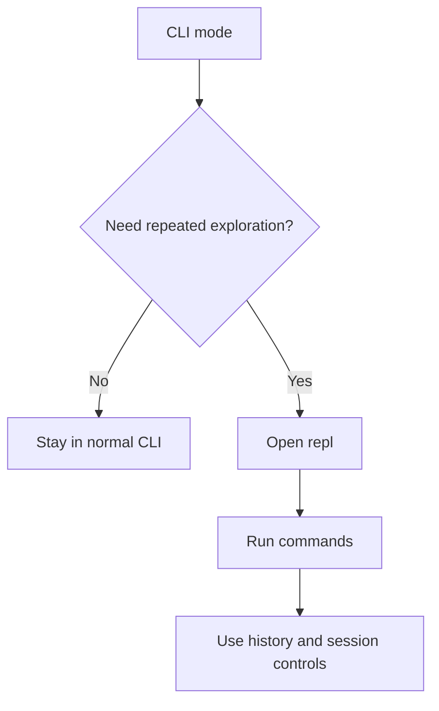
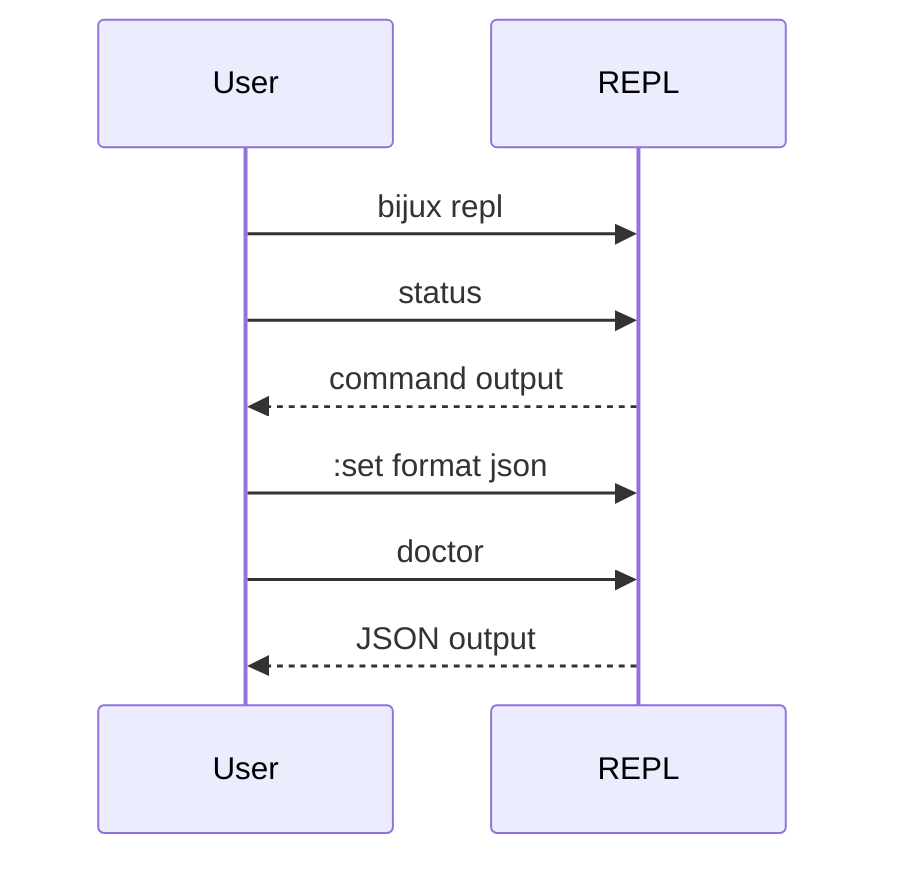

# Interactive Shell And History

## Goal

Use the REPL when interactive exploration is faster than retyping commands in a
new shell process every time, and use `bijux history` when you need to inspect
or reset the persisted command log outside the REPL.



This flowchart shows when the REPL is the right tool. It is for repeated,
interactive exploration, not for replacing the normal CLI in automation or
single-command workflows.



The sequence diagram demonstrates the main advantage of the REPL: you can keep
one session open, change session-local settings, and rerun commands without
rebuilding shell pipelines each time.

## Start The REPL

```bash
bijux repl
```

Useful session controls:

- `:help <command>`
- `:set format json|yaml|text`
- `:set quiet on|off`
- `:set trace on|off`
- `:exit`

## History And Repetition

For persisted command history, use the dedicated CLI surface:

```bash
bijux history
bijux history --limit 50
bijux history --filter status
bijux history --sort timestamp
bijux history clear --force
```

`bijux history` returns the stored command entries plus a summary object when
you request structured output. The summary tells you whether a filter was
applied, which sort mode was used, how many entries were returned, and whether
invalid entries were dropped while reading the file.

The REPL is useful when:

- you are exploring several related commands
- you want consistent session-local formatting
- you want command history without rebuilding shell pipelines repeatedly

The history command is useful when:

- you want to inspect recent commands without opening the REPL
- you need a script-safe JSON or YAML record of recent command activity
- you need to reset a corrupted history file with `bijux history clear --force`

## Honest Limit

The REPL follows the same command law as the CLI, but it is still an
interactive shell. For automation, use normal CLI invocations with explicit
output formats. The history log is operational state, not an audit ledger or a
durable event store.

## Where To Go Deeper

- [Command surface](../06-reference/command-surface.md)
- [Integrations and routed runtimes](../06-reference/integrations-and-routed-runtimes.md)
- [Routing and surfaces architecture](../04-architecture/routing-and-surfaces.md)
