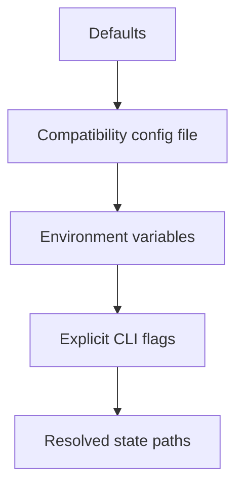
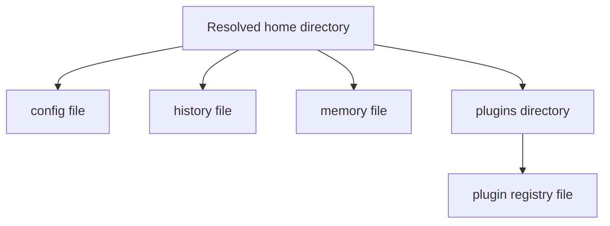
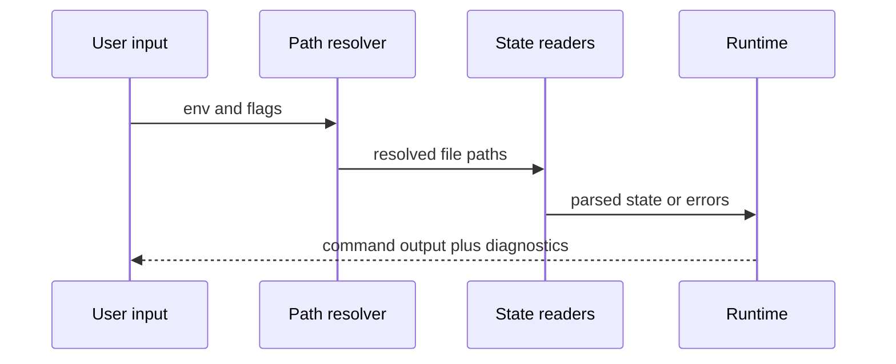
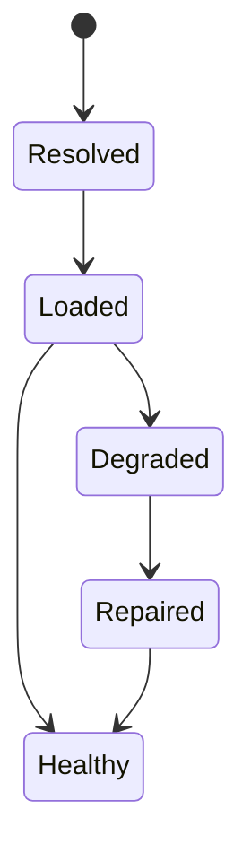

# Configuration And State

`bijux-cli` is stateful, but the architecture tries to make that state explicit and inspectable.

## Scope

This page covers:

- configuration precedence
- runtime path resolution
- the small set of durable state files the runtime manages

## Resolution Model

This diagram shows the precedence ladder that produces one effective runtime
state. The important takeaway is that path and config behavior are resolved in
one direction instead of being pieced together later in feature code.

The second diagram turns that resolution into concrete files. It shows which
durable paths the runtime owns and why plugin state is treated as part of the
same local state model rather than as a separate subsystem.

## Current State Files

The runtime currently works with a small number of state locations:

- configuration file
- history file
- memory file
- plugin directory
- plugin registry file

The exact path rules matter because the runtime treats path resolution as part of observable behavior, not as an invisible implementation detail.

## Why This Is Architectural

State handling is not just storage. It affects:

- reproducibility
- diagnostics
- plugin health checks
- compatibility behavior
- the difference between a safe reset and silent data loss

## Configuration Philosophy

The architecture prefers:

- explicit precedence
- text formats that can be inspected and repaired
- narrow data models over arbitrary blobs
- diagnostic reporting when state is malformed

It does not promise:

- every historical compatibility key forever
- silent repair of all malformed user state

## Runtime State Flow

This sequence shows how state enters command execution: resolve paths first,
read and parse state second, then return either a normal result or explicit
diagnostics to the caller.

This state diagram explains the health vocabulary around runtime files. State
can be resolved and loaded yet still be degraded, and any repair step has to be
visible rather than silently rewriting user data.

## Honest Constraint

The state model is intentionally file-oriented and local-first.

That keeps the runtime understandable, but it also means filesystem failures, permissions, and malformed local state are first-class architecture concerns rather than edge cases.
