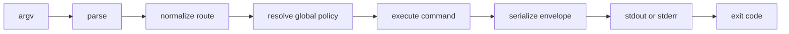
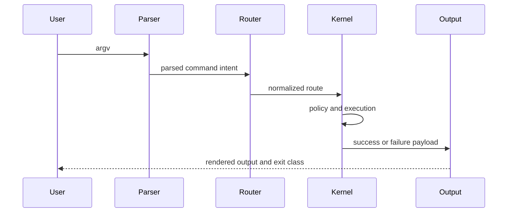
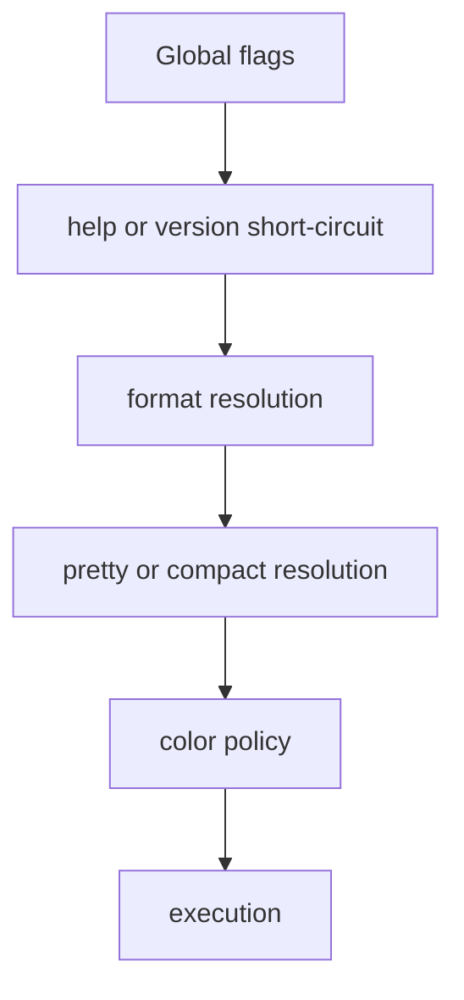
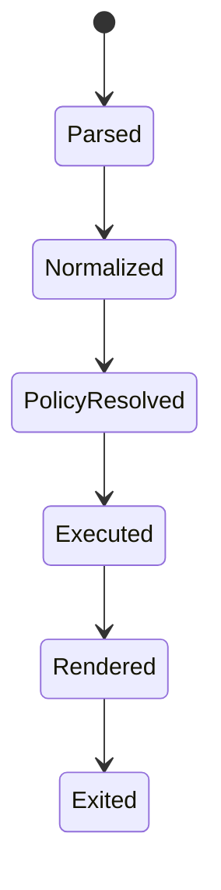

# Execution Pipeline

The runtime is best understood as a fixed pipeline.

The important architectural property is not that every command shares identical code, but that every command is forced through the same execution model.

## Pipeline Shape

This flowchart is the canonical runtime pipeline. It shows the order that every
command is expected to follow so parsing, policy, execution, rendering, and
exit behavior stay coupled in one predictable path.

The sequence diagram adds the collaborating components behind that flow. It
helps explain which layer owns parsing, route normalization, execution, and
output rendering when you are debugging behavior drift.

## Stages

### Parse

Parsing turns raw argv into a syntactic structure.

### Normalize

Normalization resolves aliases and canonical command paths.

### Resolve Policy

Global flags are interpreted once, early, and centrally.

### Execute

The command-specific handler runs with already-resolved policy.

### Emit

Text, JSON, and YAML rendering happen after execution, not inside business logic.

## Why This Matters

This architecture protects consistency:

- CLI and REPL can share semantics
- text and structured output can stay aligned
- help, output, and exit behavior can be tested as system behavior instead of incidental implementation

## Flag Handling

This diagram narrows the pipeline to global flags alone. It shows why those
flags are treated as shared runtime policy and why command handlers should not
reinterpret them independently.

The state diagram expresses the same contract as lifecycle steps. A command
should advance through these states in order, which makes failures easier to
classify and easier to test.

## What Is Deliberately Centralized

- route normalization
- output formatting
- version and diagnostics envelopes
- exit behavior

## What Is Deliberately Not Centralized

- every feature-specific decision
- every data model
- maintainer-only reporting logic

The runtime uses a common pipeline, not a single giant command implementation.
