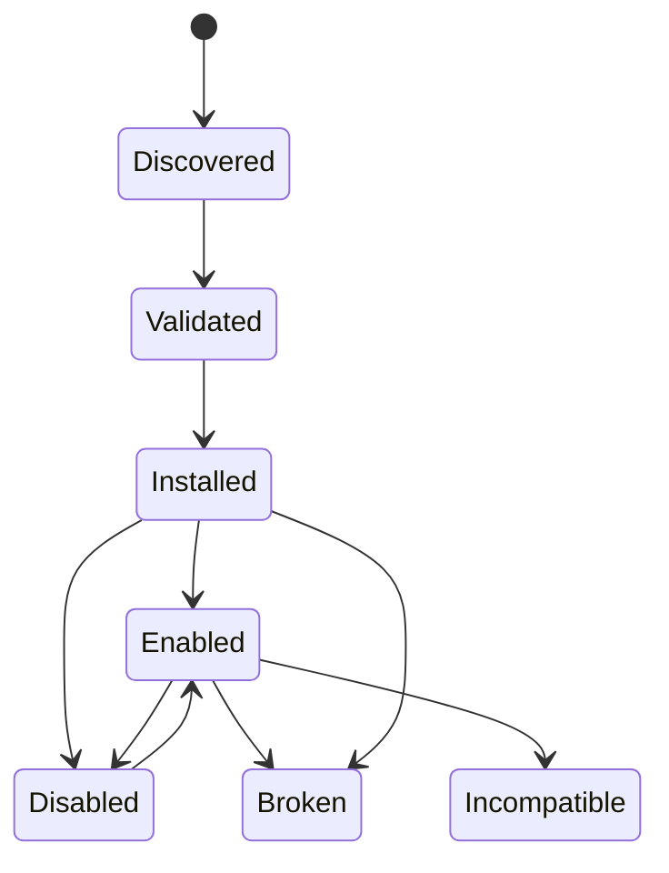
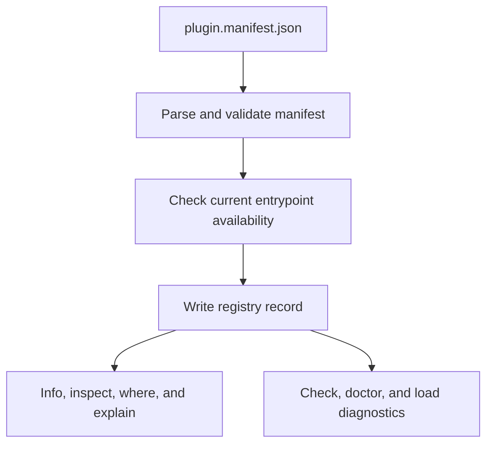
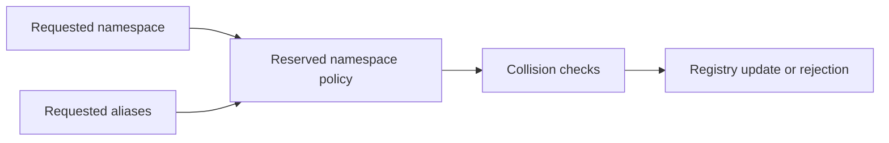
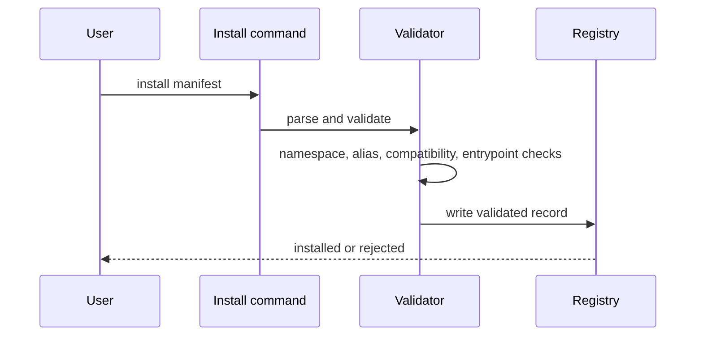

# Plugin System

The plugin system is a runtime-managed lifecycle, not a loose extension convention.

## Core Claim

Plugins are installed from `plugin.manifest.json`, persisted in the plugin registry, and validated again against current runtime conditions when the runtime needs to trust them.

## Lifecycle

This state diagram shows the lifecycle the runtime persists and diagnoses. The
important detail is that plugins can become broken or incompatible after
installation, so the registry is more than a one-time install record.

The flowchart shows how manifest validation turns into ongoing management
surfaces. Installation is only the beginning; the registry also feeds the
inspection and health commands that users rely on later.

## Current Plugin Model

The current plugin model includes:

- a versioned manifest contract
- namespace ownership rules
- alias rules
- compatibility ranges
- trust labels
- local entrypoint resolution
- routed execution for installed plugin namespaces and routed aliases
- reserved-name and alias collision checks, including official product
  namespaces and alias reuse of blocked names
- install, info, inspect, check, enable, disable, uninstall, scaffold, doctor,
  reserved-names, where, explain, and schema commands

## What The Runtime Checks Now

The runtime checks more than stored registry state.

Current health evaluation includes:

- manifest validity
- namespace and alias collision safety
- compatibility range against the current runtime semver
- manifest drift after install
- delegated or Python entrypoint availability through `module:callable`
  contracts
- external executable existence and executability

## Namespace And Alias Safety

This diagram focuses on name safety. It shows that namespaces and aliases are
checked through one policy path before any registry mutation is allowed.

The sequence diagram turns that policy into a concrete install flow. It makes
clear that validation happens before the registry write, which is what protects
users from ambiguous partial installs.

## Honest Limits

The plugin system does not currently claim:

- sandboxing
- a stable in-process native ABI
- that every plugin kind shares one identical stdout and rendering model

The plugin system does claim that installation and health reporting are real runtime responsibilities, not documentation-only promises.
Installed plugin namespaces are executable runtime routes, but they still obey
their declared kind and current registry health.

## Why The Design Is Conservative

The plugin system touches user state and local files. Conservative validation is cheaper than recovering from a broken registry or a plugin that was accepted on weak assumptions.
