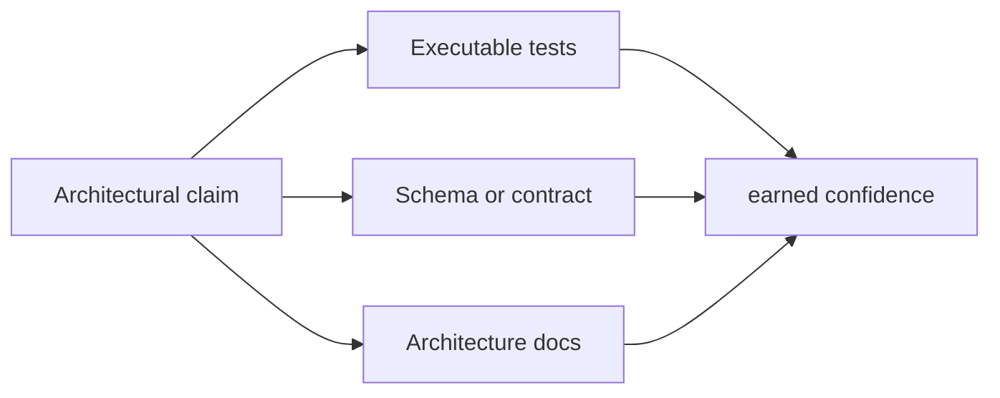
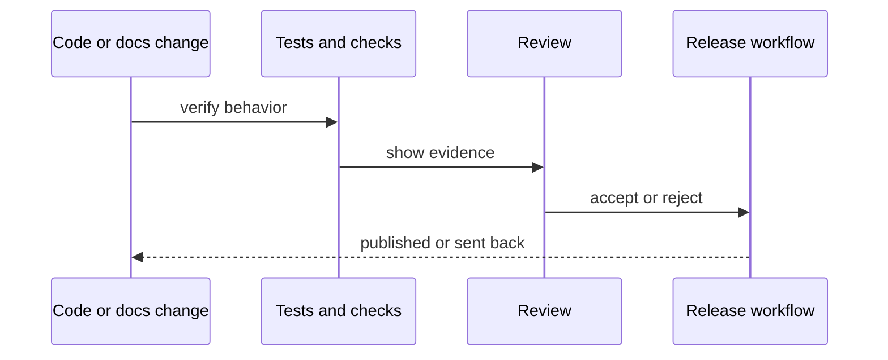
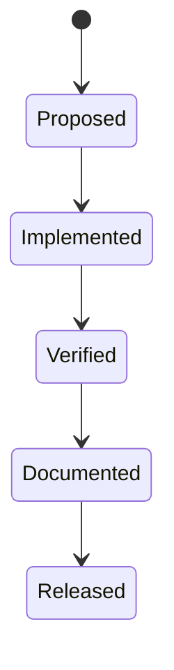
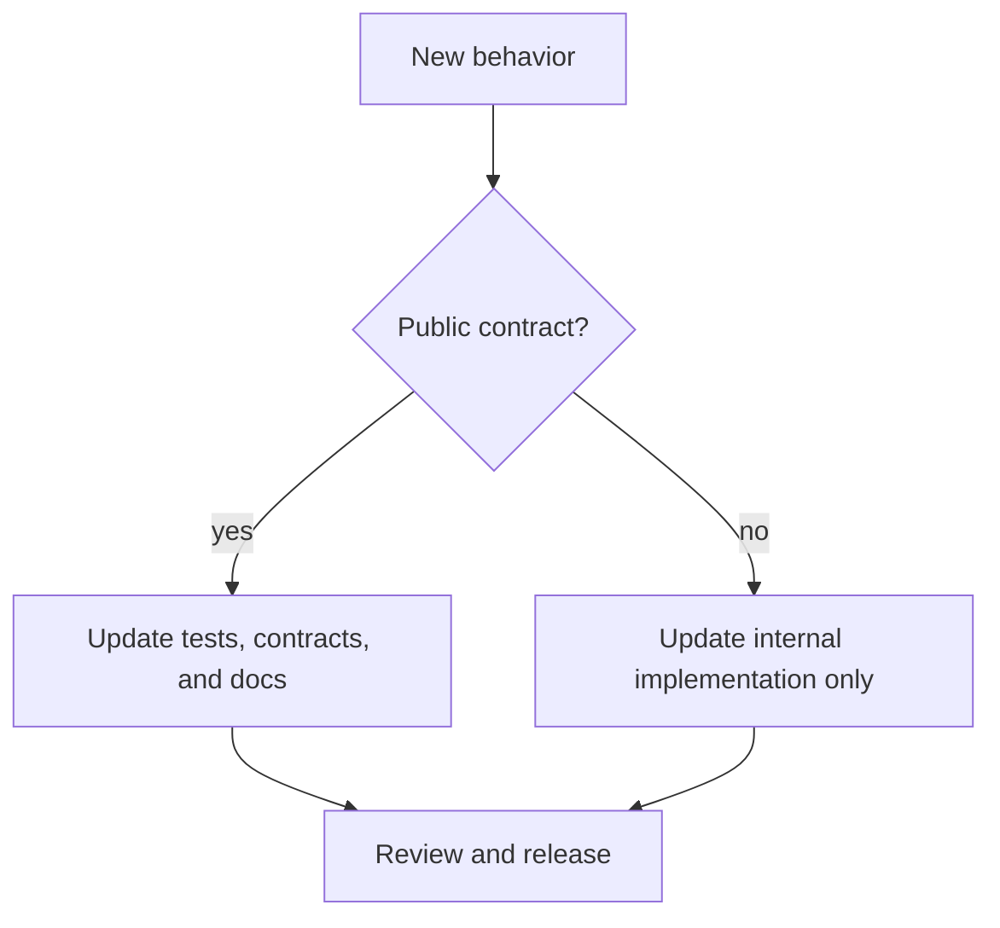

# Quality And Change Management

This project tries to earn credibility by making architectural claims that can be checked.

## Principle

Documentation is not accepted as evidence by itself.

Architectural claims should be backed by one or more of:

- executable tests
- schema snapshots
- command snapshots where appropriate
- release and maintainer checks

## Evidence Flow

This diagram explains how the repository expects confidence to be earned.
Documentation contributes context, but executable tests and contract assets are
what keep an architectural claim reviewable instead of rhetorical.

The sequence diagram shows the review loop around a change. It connects
implementation work, checks, review, and release so the quality model is tied
to the actual repository workflow.

## What Quality Means Here

Quality is not defined as “many documents” or “many reports.”

Quality means:

- public behavior is intentional
- legacy assumptions are removed when they are no longer true
- generated artifacts are disposable
- the repository does not pretend a temporary migration note is permanent architecture

## Change Rules

This state diagram expresses the expected maturity path for a change. Shipping
is intentionally later than implementation so verification and documentation do
not become optional cleanup.

The final diagram shows how contract scope changes the required follow-up. New
public behavior must update tests, docs, and contracts together, while purely
internal changes can stay narrower.

## Documentation Rule

These architecture documents should stay:

- few in number
- current
- explicit about limits
- willing to say "not supported", "not public", or "not finished" when that is the truth

## Honest Status

This repository still has complexity and some historical drag. The answer is not to hide that drag under confident prose. The answer is to keep a small architecture canon, keep it accurate, and let the code and tests carry the rest.
