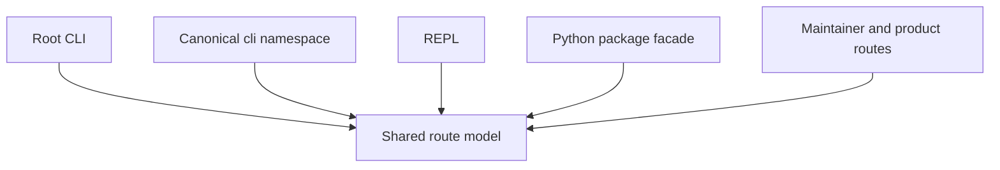
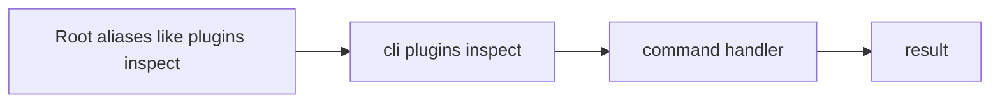
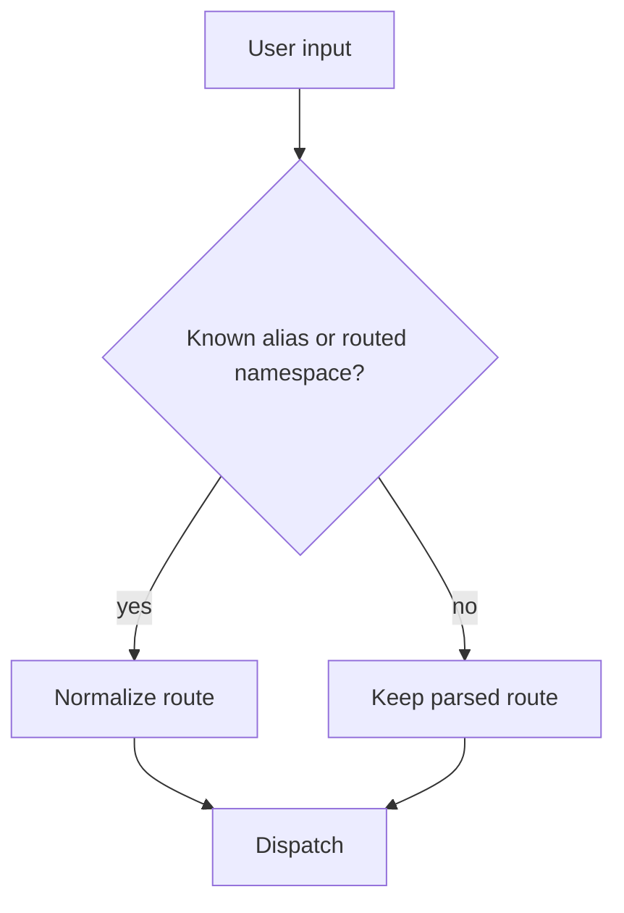
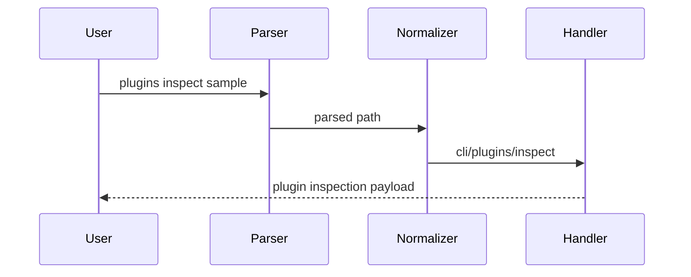

# Routing And Surfaces

The runtime exposes more than one user-facing surface, but they share a common routing model.

## Surfaces

This diagram shows the core routing claim for the runtime: several user-facing
surfaces exist, but they all rely on one shared route model instead of growing
separate command grammars.

The second diagram makes alias normalization concrete. Short root forms stay
useful for users, but they are still rewritten into canonical routed commands
before the handler runs.

## Current Surfaces

### Root CLI

This is the shortest built-in user-facing surface, for example:

- `bijux status`
- `bijux config list`
- `bijux plugins list`
- `bijux doctor`

### Canonical `cli` Namespace

This is the explicit runtime namespace for routes that either do not exist at
the root or are useful to inspect in their normalized form:

- `bijux cli paths`
- `bijux cli plugins inspect`
- `bijux cli self-test`

The canonical namespace matters because it exposes the normalized route shape
even when shorter root commands also exist.

### Maintainer And Product Surfaces

These surfaces stay separate from the runtime command inventory:

- `bijux-dev-cli ...` for the maintainer control-plane
- `bijux <product> ...` and `bijux dev <product> ...` for routed adjacent
  runtime and control-plane entrypoints
- `bijux-<product> ...` and `bijux-dev-<product> ...` for the owned binaries
  behind those routed entrypoints when the executables are available

### REPL

The REPL is an interface, not a separate architecture.

It uses the same routing and execution model as the CLI as far as practical.

### Python Package Facade

The Python package is a distribution surface that calls into the Rust runtime or its bridge layer. It is not the authoritative source of routing rules.

## Current Root Command Comparison

The legacy Python command inventory and the current Rust-routed root inventory
still overlap heavily, but they are no longer identical.

- Python documented root commands: 14
- Rust routed root commands: 15
- Overlap: 14
- Python-only: 0
- Rust-only: 1

The one current Rust-only routed root command is `cli`. That difference is
intentional: the Rust runtime exposes `cli` as the canonical namespace for
normalized subcommands, while shorter aliases remain available for common root
workflows.

## Alias Policy

This flowchart shows the decision that happens after parsing: known aliases and
routed plugin namespaces are normalized, while unknown paths remain unchanged
until dispatch decides what to do with them.

The sequence diagram demonstrates that normalization with a real command. A
short root alias such as `plugins inspect` still reaches the canonical handler
path before the payload is produced.

## Help Surface

Help is part of the routed surface, not an afterthought.

The project treats help output as a contract because:

- users rely on it as the first explanation of the command surface
- snapshot tests catch accidental drift
- bad examples in help become real usability defects

## Honest Boundary

The route model is shared, but not every route is equal:

- some routes are public runtime behavior
- some routes are normalized compatibility aliases
- some routes are routed product or maintainer namespaces backed by owned
  binaries

The architecture works because those categories are kept separate in code and documentation.
