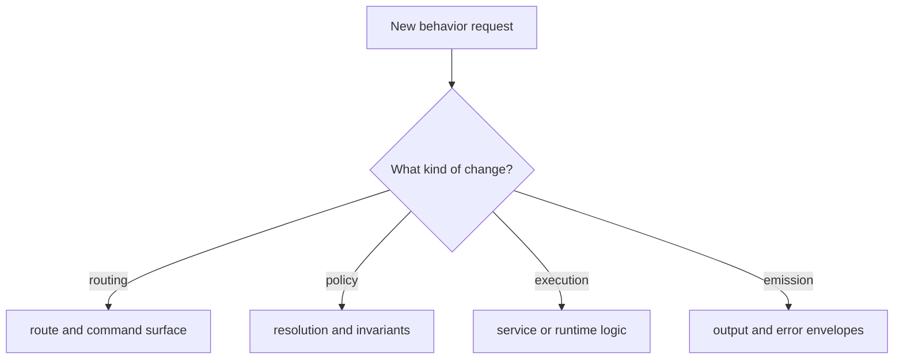
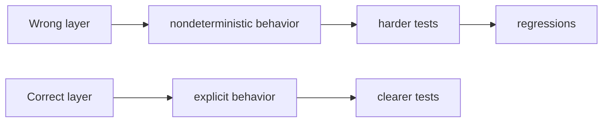

# Change Model

## Goal

Put changes in the right layer so behavior stays predictable and reviewable.

This diagram is the first routing question for a code change. It helps a
contributor classify the change before implementation so behavior lands in the
right layer instead of being hidden in the nearest convenient file.

The second diagram explains why that classification matters. Correct placement
leads to clearer tests and more explicit behavior, while the wrong layer tends
to create regressions and confusing side effects.

## Mental Model

The runtime is a pipeline. Contributors should ask where a decision belongs
before writing code:

1. route selection
2. policy resolution
3. command or service execution
4. output and error emission

## Rules

- do not hide policy decisions in command handlers when they belong in shared
  runtime logic
- do not read raw environment state from arbitrary places if the runtime already
  resolves it centrally
- do not duplicate output formatting in many commands when emission belongs in
  one place
- treat plugin behavior as part of the runtime contract, not as a side lane

## Honest Standard

If a change is hard to place in the model, that is usually a sign the design is
still unclear. Write the rule down before expanding the implementation.

## Read Next

Continue to [Testing And Evidence](testing-and-evidence.md).
