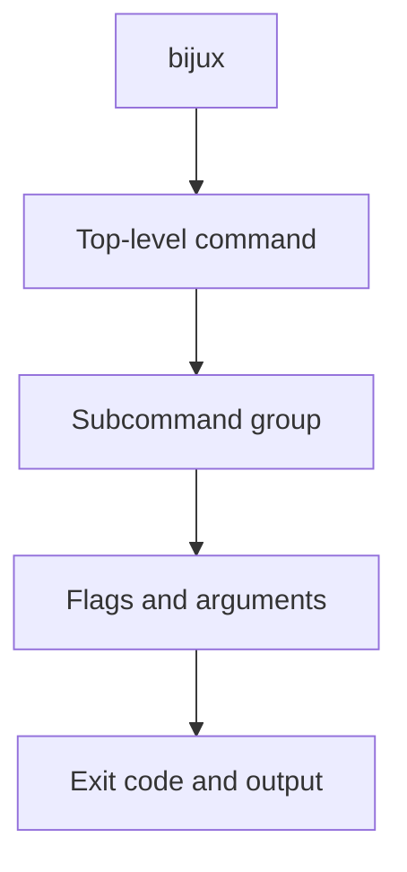
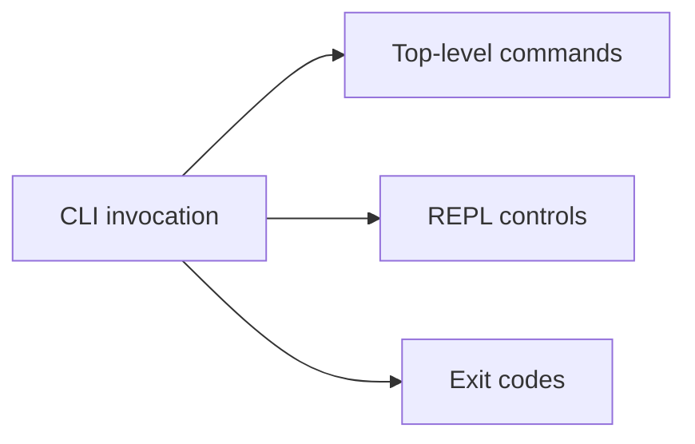

# Command Surface

## Purpose

This page lists the current command surface, key subcommand groups, REPL session
controls, and stable exit codes.

This diagram shows how to read the command inventory on this page. Start at the
top-level command, then drill into subcommand groups, flags, and finally the
observable output and exit behavior.

The second diagram explains the page scope. It is not only a CLI list: it also
records REPL session controls and the stable exit-code table that automation
depends on.

## Built-In Top-Level Commands

| Command | Purpose |
| --- | --- |
| `cli` | Canonical runtime namespace for explicit subcommands such as `paths` and `self-test` |
| `audit` | Read-only diagnostics audit report |
| `config` | Configuration management |
| `docs` | Read-only documentation index and availability report |
| `doctor` | Environment diagnostics |
| `help` | Global help |
| `history` | REPL history tools |
| `install` | Install the runtime, maintainer CLI, or an official product package |
| `memory` | In-memory key/value tools |
| `plugins` | Plugin management |
| `repl` | Interactive shell |
| `completion` | Shell completion output for an explicit or detected shell target |
| `status` | Read-only CLI status probe |
| `version` | CLI version |

## Common Subcommand Groups

### `cli`

`status`, `paths`, `doctor`, `version`, `repl`, `completion`, `config`, `self-test`, `plugins`

### `config`

`list`, `get`, `set`, `unset`, `export`, `load`, `reload`, `clear`

### `plugins`

`list`, `info`, `inspect`, `check`, `enable`, `disable`, `install`,
`uninstall`, `scaffold`, `doctor`, `reserved-names`, `where`, `explain`,
`schema`

### `history`

Root options: `--limit`, `--filter`, `--sort timestamp`

Subcommands: `clear`

### `memory`

`clear`, `delete`, `get`, `list`, `set`

## Adjacent Product Routes And Binaries

Maintainer and product tooling stays outside the runtime command inventory:

- `bijux-dev-cli ...` for the maintainer control plane
- `bijux <product> ...` for routed adjacent Bijux product runtimes
- `bijux dev <product> ...` for routed adjacent Bijux product control planes
- `bijux-<product> ...` for direct adjacent Bijux product runtimes
- `bijux-dev-<product> ...` for direct adjacent Bijux product control planes

Use [Integrations And Routed Runtimes](integrations-and-routed-runtimes.md) for
the product-binary and maintainer-binary rules.

## REPL Session Controls

When using `bijux repl`, the documented session controls are:

- `:help <command>`
- `:set trace on|off`
- `:set quiet on|off`
- `:set format json|yaml|text`
- `:exit`

## Structured Output Notes

### `status`

- structured output returns the current runtime, install, state, and plugin summary
- this is a read-only diagnostic snapshot, not a deployment or workflow executor
- current JSON shape includes `status`, `runtime`, `state`, `plugins`, `install`, and `issues`
- `status` becomes `warning` or `degraded` when the snapshot includes warning or error issues

### `docs`

- structured output returns the current documentation inventory
- this is a read-only discovery surface for local docs paths and published references
- current JSON shape includes `status`, `site_url`, `local_docs_root`, `references`, and `missing_references`
- `status` becomes `warning` when the local docs root or any documented reference is missing

### `audit`

- structured output returns current runtime audit checks and issues
- this is a read-only diagnostics report, not a maintainer remediation workflow
- current JSON shape includes `status`, `checks`, and `issues`
- install warnings include path shadowing, duplicate installs, stale wrappers, legacy conflicts, and wheel/binary version mismatches

### `completion`

- text output emits the generated completion script for the selected shell
- `--shell <bash|zsh|fish|pwsh>` selects a shell explicitly; otherwise the
  runtime falls back to shell detection and then to `bash`
- JSON or YAML output returns `active_shell`, `selection_source`,
  `supported_shells`, `supported_platforms`, `windows_supported`,
  `target_file`, and `script`
- `pwsh` support applies to supported Linux/macOS hosts; Windows is not part
  of the current completion contract
- that Windows exclusion is deliberate today: script generation exists, but the
  surrounding completion install paths and host support contract are still
  Linux/macOS-oriented

### `install`

- accepts `cli`, `dev-cli`, `<product>`, and `dev-<product>` target aliases
- `--dry-run` prints or returns the exact `cargo install --locked ...` command
- product aliases resolve from `contracts/official_product_namespace_registry.json`
- alias resolution does not by itself guarantee that every target is published on every install channel

### `version`

- text output is a single-line summary
- JSON or YAML output includes `name`, `version`, `semver`, `source`,
  `git_commit`, `git_dirty`, and `build_profile`

### `history`

- structured output returns `entries` and `summary`
- the summary records filter state, sort mode, returned-entry count, and file
  integrity counters

### `config export` and `config load`

- `config export PATH` writes dotenv-style config and confirms the target file
- `config load PATH` reads dotenv-style config and confirms the source file
- current JSON export shape includes `status`, `file`, and `file_format`
- current JSON load shape includes `status` and `file`

## Stable Exit Codes

| Code | Meaning |
| --- | --- |
| `0` | Success |
| `1` | Internal or general runtime failure |
| `2` | Usage or user-input error |
| `3` | Serialization, ASCII, or encoding error |
| `130` | User abort or interruption |

## Honest Limit

This page is a command inventory, not a full behavior tutorial. For usage
workflows, go to [User Guide](../03-user-guide/index.md).
