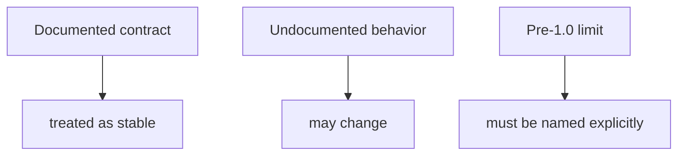
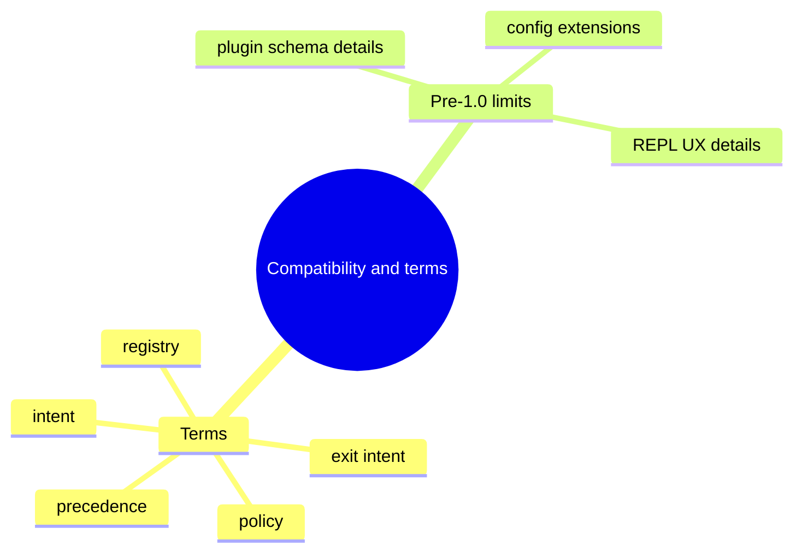

# Compatibility And Terms

## Purpose

This page records the main pre-1.0 compatibility limits and the core terms used
across the docs and runtime.

This diagram shows the classification rule behind the page. Stability comes
from documented contracts, while undocumented behavior remains movable and
pre-1.0 limits must be called out directly.

The mindmap groups the vocabulary and the current pre-1.0 flexibility in one
place. It helps readers distinguish stable core terms from areas where the
project still reserves room to adjust details.

## Core Terms

| Term | Meaning |
| --- | --- |
| `intent` | A fully resolved command request with flags and context |
| `policy` | Output and logging rules derived from precedence |
| `exit intent` | A structured exit decision with code and payload |
| `registry` | The plugin registry storing metadata and state |
| `precedence` | The ordering rules used to resolve configuration inputs |

## Pre-1.0 Compatibility Limits

Before `1.0`, the repository may still introduce changes to:

1. plugin metadata schema fields and validation details
2. REPL UX details such as completion, prompts, and formatting
3. config extensions and newly added config keys

## Pre-1.0 Guarantees Already Treated As Stable

- documented exit codes remain stable
- documented precedence rules remain stable
- critical CLI and Python compatibility checks remain part of release review

## Change Discipline

If a pre-1.0 surface changes incompatibly, the repository should:

- document it explicitly
- update the relevant tests and docs
- provide a short migration note when the change affects users or maintainers

## Honest Limit

Undocumented behavior is not part of the compatibility promise, even if it has
existed for some time.
