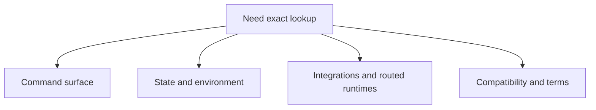
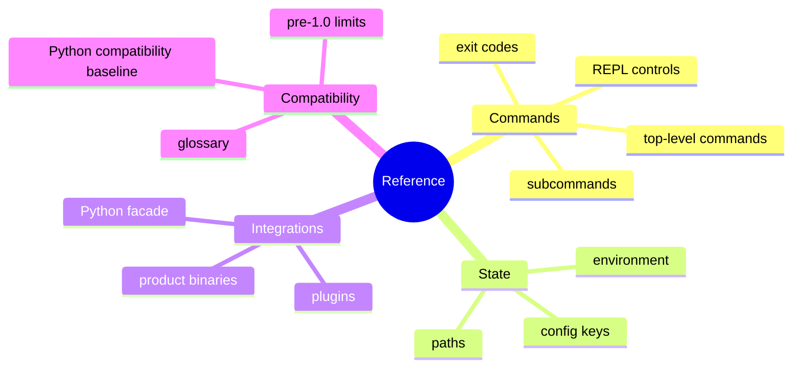

# Reference

## Purpose

This section is the canonical lookup surface for exact facts. It is for people
who already know what they are doing and need stable names, tables, and limits
without tutorial framing.

This flowchart is the lookup map for the reference section. It points readers
to the right page based on whether they need command facts, state rules,
integration boundaries, or compatibility terminology.

The mindmap summarizes the same reference territory by topic cluster. It is a
quick way to confirm whether the answer you need belongs in commands, state,
integrations, or compatibility language.

## Read This Set By Need

1. [Command Surface](command-surface.md)
2. [State And Environment](state-and-environment.md)
3. [Integrations And Routed Runtimes](integrations-and-routed-runtimes.md)
4. [Compatibility And Terms](compatibility-and-terms.md)

## Scope

These pages are intentionally different from guides:

- they prioritize exact facts over narrative instruction
- they describe current documented surfaces only
- they avoid duplicating architecture explanation except where a boundary matters

## Next Step

If you need workflows, go to [User Guide](../03-user-guide/index.md). If you
need system shape, go to [Architecture](../04-architecture/index.md).
