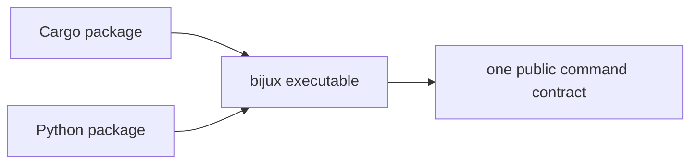
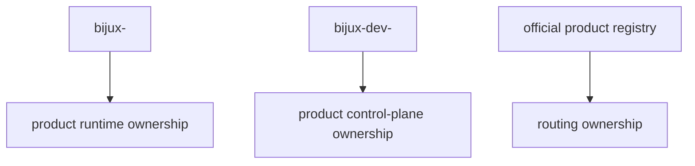

# Distribution And Ownership

## Purpose

This page defines package naming, binary ownership, routed product naming, and
the compatibility obligations of the Python distribution.

This diagram shows the ownership rule for the public command. Different package
channels may deliver the runtime, but they are still required to converge on
one `bijux` command contract.

The second diagram explains how product binaries stay separate from the public
runtime while still fitting into one naming and routing policy.

## Package Naming Contract

### Cargo

- canonical crate identity: `bijux-cli`
- the documented and preferred install channel is `bijux-cli`
- `bijux-dev-cli` is a workspace maintainer crate and must not be treated as a
  published public install channel

### Python

- canonical distribution: `bijux-cli`
- the documented and preferred install channel is `bijux-cli`

## Binary Ownership Rule

`bijux-cli` is the sole owner of the public `bijux` command contract.
Published install packages must delegate to the same runtime behavior. They
must not publish divergent public executables under the `bijux` command name.

## Routed Product Naming

- runtime tool binaries follow `bijux-<tool>`
- control-plane binaries follow `bijux-dev-<tool>`
- runtime and control-plane binaries stay separate from the public `bijux`
  runtime command surface

The machine-readable routed product registry is
`contracts/official_product_namespace_registry.json`. The documentation site
publishes a copy under its `contracts/` path.

## Python Distribution Policy

- the Python distribution is Rust-backed
- existing `pip install bijux-cli` users retain command-line compatibility
- `bijux-cli` is the only documented Python distribution name
- wrappers must delegate to the same Rust command engine
- Python API changes require additive compatibility shims or explicit
  deprecation messaging
- tagged release publication must produce package metadata that matches the tag
  version exactly, even when the working branch stays on the next dev line

## Honest Limit

This contract defines ownership and routing boundaries. It does not promise
that every alias channel will exist forever without deprecation notice.
