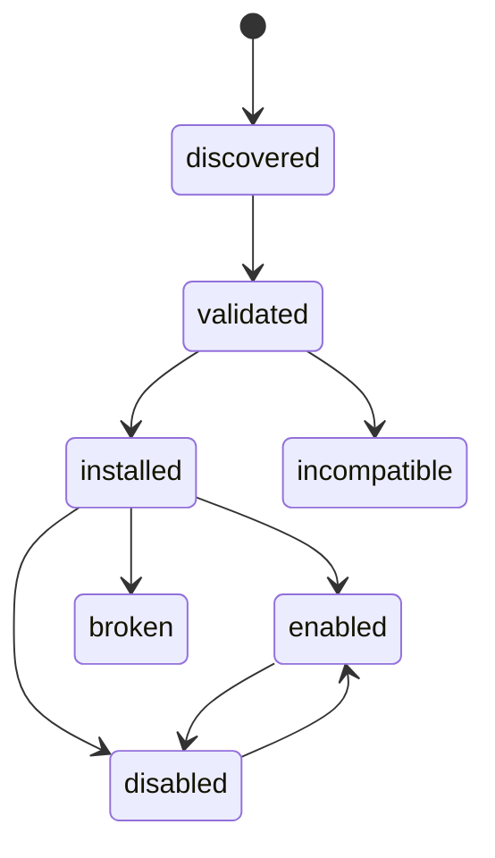
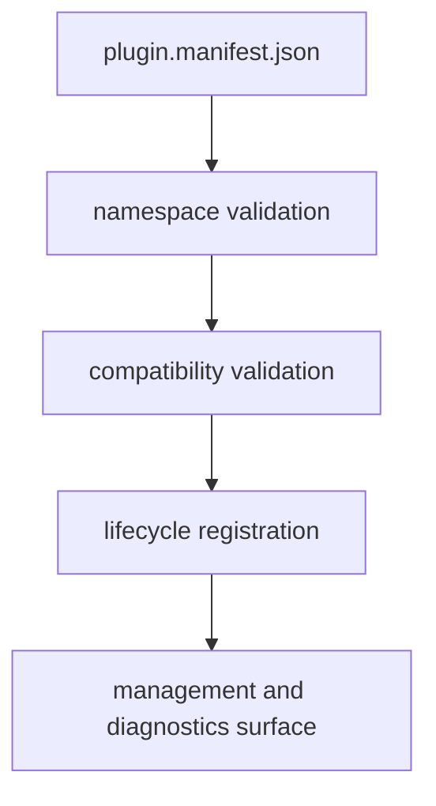

# Plugin Contracts

## Purpose

This page defines the public plugin contract: namespace rules, lifecycle terms,
supported kinds, and the hard limits users must understand before installing a
plugin.

This state diagram defines the stable lifecycle vocabulary for plugins. It is
the reference for registry persistence and diagnostics, not just a loose sketch
of possible states.

The second diagram shows how a manifest becomes part of the managed plugin
surface: validate the namespace and compatibility first, then register the
lifecycle state that later commands inspect and diagnose.

## Namespace Rules

- plugins must not claim reserved root namespaces
- plugin namespaces are normalized to lowercase kebab-case
- plugin aliases are normalized to lowercase kebab-case
- namespace registration is rejected when it conflicts with built-ins or
  existing plugin namespaces
- case-insensitive collisions are rejected
- alias registration is rejected when it conflicts with built-ins, reserved
  namespaces, existing plugins, or other aliases

## Lifecycle Terms

The stable lifecycle state terms are:

- `discovered`
- `validated`
- `installed`
- `enabled`
- `disabled`
- `broken`
- `incompatible`

These terms are stable for registry persistence and diagnostics.

Lifecycle transitions are expected to validate metadata first, keep registry and
filesystem state aligned, and avoid leaving ambiguous partial installs behind on
failure.

## Manifest And Kind Policy

- the durable local plugin contract is based on `plugin.manifest.json`
- `plugins install` accepts either a plugin directory root or an explicit
  `plugin.manifest.json` path
- current manifest baseline is `v2`
- unknown major manifest versions are rejected
- supported executable kinds are `delegated`, `python`, and `external-exec`
- `delegated` and `python` entrypoints must use `module:callable`
- `delegated` and `python` execution requires Python 3.11 or newer on `PATH`
- `external-exec` entrypoints are executable filesystem paths or manifest-local
  executable names
- `native` is reserved for forward compatibility and is intentionally not
  executable today

## Stable Management Surface

The current plugin-management contract covers:

- `info`
- `list`
- `inspect`
- `check`
- `enable`
- `disable`
- `install`
- `uninstall`
- `scaffold`
- `doctor`
- `reserved-names`
- `where`
- `explain`
- `schema`

`inspect` may target one plugin or the full inventory.
`explain` may target one plugin, an unknown name, or the full inventory
summary.
`doctor` is the registry-wide health and self-repair view.
Installed plugin namespaces and declared plugin aliases are also executed as
direct runtime subcommands
under `bijux` when their kind and registry health allow it.

## Stability Standard

Treat the plugin-management surface as stable only when all of the following
remain true:

- scaffolded plugins are installable and checkable for the supported kinds
- install, uninstall, enable, and disable preserve registry consistency and
  rollback guarantees on failure
- corrupt registry input is diagnosable and any self-repair behavior is
  explicit
- plugin command failures keep the documented stdout, stderr, and exit-code
  contract
- current health evidence exists through live tests or maintainer checks
  instead of checked-in artifact snapshots

## Trust And Safety Limits

- plugins are not sandboxed
- trust metadata may be surfaced as `core`, `verified`, `community`, or
  `unknown`
- capability and compatibility checks happen before activation
- broken and incompatible plugins must be diagnosed instead of silently treated
  as healthy

## Honest Limit

This contract governs plugin compatibility and lifecycle behavior. It does not
claim that plugin code is safe merely because it is installable.
