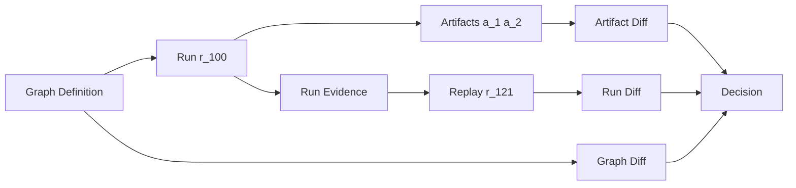

# Core Concepts

Bijux-dag is easiest to understand as a time-ordered object system, not a glossary. A graph defines intent, a run records one execution instance of that intent, artifacts record output units from that run, replay re-executes for validation, and diff classifies change.

## The object relationship model

Think in relationships instead of isolated nouns:

- a `graph` can produce many `runs` over time;
- a `run` contains node outcomes and can produce many `artifacts`;
- `replay` creates new run evidence using baseline context;
- `diff` compares graph/run/artifact surfaces and classifies divergence.

When operators ask “what changed,” they are moving across these relationships.

## Lifecycle across time

Practical sequence:

1. author and validate graph,
2. execute run,
3. inspect run/artifact evidence,
4. replay baseline when confidence is required,
5. diff baseline and candidate evidence,
6. make release or remediation decision.

## How these concepts are often confused

### Graph identity vs run identity vs artifact identity

- Graph identity answers: “which definition state?”
- Run identity answers: “which execution instance?”
- Artifact identity answers: “which canonical output unit?”

Common mistake: treating equal graph identity as proof of equal run outcome. It is not; environment/input differences can still cause run or artifact drift.

### Replay vs diff

- Replay produces new evidence under replay rules.
- Diff compares two evidence surfaces and classifies result.

Common mistake: using replay output alone as final decision evidence without scoped diff analysis.

## Guarantees you can rely on

- Every durable artifact is attributable to run and node context.
- Run identity remains the primary key for execution evidence retrieval.
- Graph, run, and artifact comparison can be scoped independently.

## Operational boundaries

- This page is conceptual, not the normative field-level contract.
- Identity/hash algorithms are defined in specification docs.
- Backend-specific behavior limits are defined in operations and architecture docs.

## Next reading

- Canonical vocabulary: [Terminology](../01-introduction/05-terminology.md)
- Formal DAG contract: [DAG Model Specification](../06-specification/01-dag-model.md)
- Formal run and artifact contracts: [Run Model](../06-specification/02-run-model.md), [Artifact Model](../06-specification/03-artifact-model.md)
- Replay/diff contract meanings: [Replay Semantics](../06-specification/07-replay-semantics.md), [Diff Semantics](../06-specification/08-diff-semantics.md)
