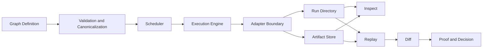

# System Overview

Bijux-dag is organized around one execution truth loop:

```text
graph definition -> planning -> execution -> run/artifact evidence -> replay/diff -> proof-oriented decision
```

Everything in the architecture exists to keep that loop inspectable and falsifiable.

## End-to-end architecture flow

1. `graph` is validated and canonicalized.
2. `planner/scheduler` computes dependency-correct readiness.
3. `execution engine` dispatches ready nodes through adapters.
4. `run directory` and `artifact store` persist evidence.
5. `inspect`, `replay`, and `diff` consume persisted evidence.
6. operator or CI makes release/progression decision from classified outcomes.

## Unified subsystem diagram



## What bijux-dag intentionally excludes

The system deliberately does not try to be:

- a universal orchestration platform for every scheduling model,
- a replacement for external policy/compliance systems,
- a source of unbounded portability claims across unsupported backend capabilities.

These exclusions protect contract clarity and reduce false confidence.

## Next reading

- Crate responsibility boundaries: [Crate Architecture](../05-system-architecture/02-crate-architecture.md)
- Runtime mechanics: [Execution Engine](../05-system-architecture/03-execution-engine.md)
- Evidence persistence surface: [Run Directory](../05-system-architecture/07-run-directory.md), [Artifact Store](../05-system-architecture/06-artifact-store.md)
