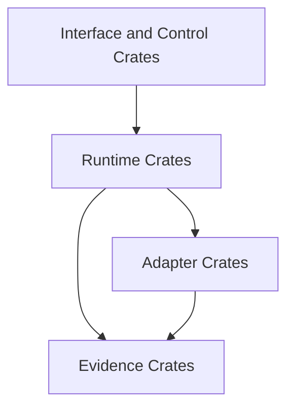

# Crate Architecture

Crates are grouped by responsibility so guarantees stay local and auditable.

## Responsibility boundaries

- interface/control crates: CLI and developer control surfaces.
- runtime crates: graph execution, scheduling, outcome normalization.
- evidence crates: run/artifact identity, persistence, retrieval.
- adapter crates: backend translation and capability declarations.

A crate boundary is correct only if it prevents semantic leakage between these domains.

## Dependency shape

This reflects current conceptual layering. Exact crate names may evolve, but dependency direction should not.

## Logic that must never cross boundaries

- CLI/control crates must not define runtime execution semantics.
- Adapter crates must not redefine DAG/run/artifact contracts.
- Evidence crates must not choose scheduling policy.
- Runtime crates must not hardcode backend-specific behavior that belongs in adapters.

If these rules are violated, replay/diff trust degrades because semantics become implicit and scattered.

## Next reading

- Runtime execution roles: [Execution Engine](../05-system-architecture/03-execution-engine.md)
- Adapter contract boundary: [Adapters](../05-system-architecture/05-adapters.md)
- Contributor ownership guidance: [Repository Structure](../08-development/01-repository-structure.md)
