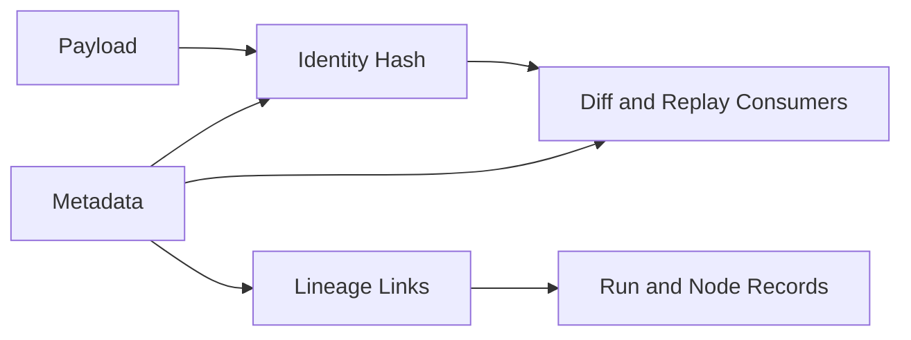

# Artifact Store

Artifact store links payload persistence with identity and lineage so output comparisons remain trustworthy.

## Storage model

Artifact store maintains four coupled surfaces:

- payload bytes/content,
- metadata record,
- identity/hash fields,
- lineage links to run and node provenance.

Treating these as separate concerns in operations leads to unverifiable comparisons.

## Relationship diagram

## Corruption detection and recovery expectations

Corruption indicators:

- metadata references missing payload,
- payload hash mismatch against stored identity,
- lineage references unresolved run/node records.

Recovery expectations:

1. quarantine corrupted artifact records,
2. preserve evidence for incident review,
3. regenerate from trusted run/bundle where possible,
4. re-validate lineage and identity before restoring comparison use.

## Next reading

- User-facing artifact behavior: [Artifacts](../03-user-guide/03-artifacts.md)
- Identity contract details: [Artifact Identity Specification](../06-specification/06-artifact-identity.md)
- Portability implications: [Bundles And Portability](../03-user-guide/08-bundles-and-portability.md)
