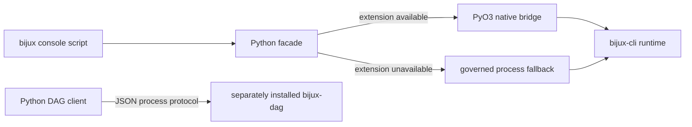
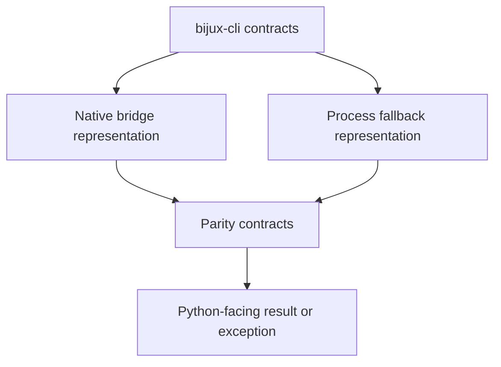

# `bijux-cli-python` Architecture

`bijux-cli-python` packages the Bijux command for Python environments and
adapts Python callers to the canonical Rust runtime. It is a distribution and
interop boundary, not an independent command implementation.

## Components

The package has two cooperating implementations:

| Area | Responsibility |
| --- | --- |
| Rust `src/` | PyO3 module, runtime invocation, compatibility paths, JSON bridge payloads, error classification |
| Python `python/bijux_cli_py/` | console entrypoint, native/fallback selection, process runtime, mounted-app SDK, DAG process client |

`pyproject.toml` and Maturin assemble them into one wheel. The extension is
published as `bijux_cli_py._native` with the Python 3.11 stable ABI.

## Invocation Paths

The distribution supports three distinct paths:

1. The `bijux` console script enters `bijux_cli_py.cli`.
2. Python facade calls select the native bridge when available and use the
   governed process fallback when the bridge cannot be loaded.
3. `dag_sdk` invokes a separately installed `bijux-dag` executable and decodes
   its JSON envelope.

The first two paths must preserve `bijux-cli` semantics. The third preserves
`bijux-dag-cli` semantics and must not imply that DAG execution lives in this
package.

The native and fallback branches are alternate transports to one `bijux`
authority. The DAG branch is a separate process-client boundary and never
joins the root-runtime implementation.

## Authority Boundaries

The Rust runtime owns commands, route policy, output envelopes, exit codes,
configuration semantics, plugins, and mounted-product discovery. This package
owns:

- Python packaging metadata and supported interpreter range;
- bridge representation and exception classification;
- native-extension loading and process fallback;
- mounted Python app helper ergonomics;
- executable resolution and transport behavior for the DAG client.

Maintainer commands and repository governance are intentionally excluded.

## Native Bridge

`src/bindings.rs` invokes `bijux_cli::api::runtime::run_app`. It normalizes
argument vectors, preserves complete execution outcomes, and serializes bridge
payloads as JSON. `src/conversions.rs` maps runtime failures into stable coarse
categories. `src/compatibility.rs` re-exports the canonical install and path
helpers from `bijux-cli`.

The PyO3 module stays thin: it translates Python arguments, calls these Rust
functions, and maps bridge failures to Python exceptions.

## Python Facade

`_facade.py` owns native/fallback selection, while `_runtime.py` owns
executable discovery and subprocess behavior. `cli.py` is the console
entrypoint. `app_sdk.py` and `dag_sdk.py` are separate SDK surfaces with
different authorities and deployment requirements.

Fallback exists for operational resilience; it is not permission to diverge.
Parity tests are the release gate for both paths.

An error-classification or envelope change must converge through parity before
it becomes part of the Python-facing contract.

## Verification

Architecture and ownership are covered by:

- `tests/maintainer_leakage_boundaries.rs`;
- `tests/runtime_entrypoint_unity.rs`;
- `tests/python_packaging_ownership.rs`;
- `tests/python/test_packaging_contracts.py`;
- `tests/python/test_runtime_parity.py`.

Any component move must preserve wheel contents, one console authority,
native/fallback parity, and the separation between root-runtime and DAG-client
behavior.
