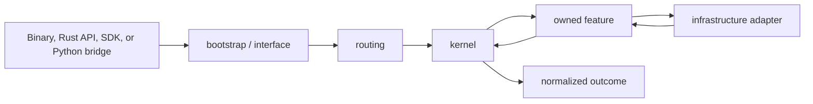
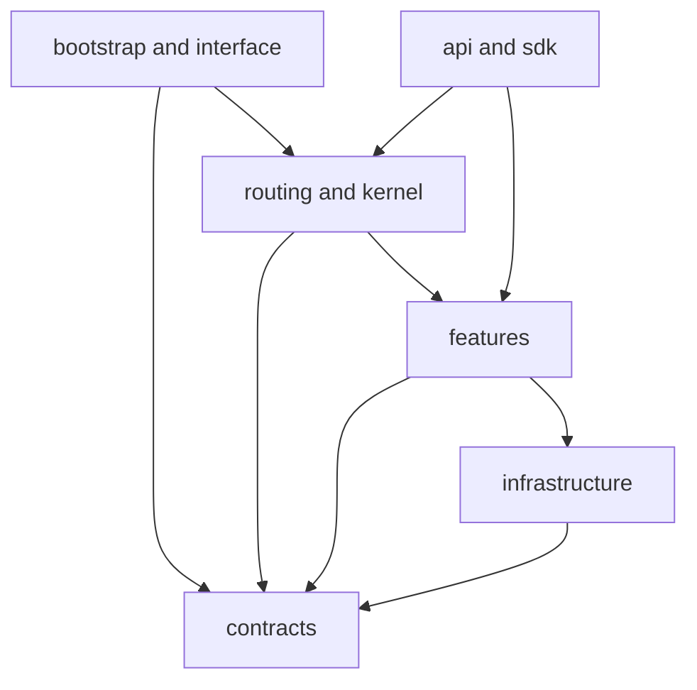

# `bijux-cli` Architecture

`bijux-cli` is the command-runtime package for the `bijux` executable. Its
architecture keeps command meaning independent of whether a caller uses the
native binary, the Rust facade, the in-process SDK harness, or the Python
bridge.

## Runtime Flow

The runtime processes an invocation through five owned boundaries:

1. `bootstrap` reads process arguments and maps the final result to streams and
   an exit status.
2. `interface` parses operator input and adapts CLI or REPL calls into runtime
   requests.
3. `routing` normalizes aliases, selects a canonical route, and resolves
   built-in, plugin, or mounted-product ownership.
4. `kernel` resolves execution policy, runs the selected handler, and
   normalizes success, failure, cancellation, and panic outcomes.
5. `features` implements config, diagnostics, history, install, memory, and
   plugin behavior through adapters in `infrastructure`.

`api` exposes intentional entrypoints into those layers. `contracts` owns
shared data shapes, while `sdk` supplies the application-facing composition
surface.



Only the outer entry and rendering adapters vary by caller. Route selection,
feature policy, lifecycle normalization, and state semantics remain one native
runtime contract.

## Dependency Direction

The intended source dependency direction is:



Infrastructure must not decide command semantics. A filesystem adapter may
report that a manifest cannot be read, but routing and feature policy decide
what that means for the invocation. Conversely, parsing and route discovery
must not perform hidden writes or subprocess launches.

## Stable And Internal Surfaces

The crate exposes three deliberate integration boundaries:

- `bijux_cli::api` for runtime and query consumers;
- `bijux_cli::contracts` for schemas, envelopes, configuration, plugins, and
  mounted-product descriptors;
- `bijux_cli::sdk` for embedded applications and the in-process harness.

All other top-level modules are private to the crate. Their tests protect
architecture and behavior, but their internal types are not compatibility
promises for downstream packages.

## State Ownership

Runtime state has explicit owners:

| State | Semantic owner | Access boundary |
| --- | --- | --- |
| configuration | `features/config` | filesystem and environment adapters |
| history | `features/history` | state paths and append/read adapters |
| memory | `features/memory` | governed state store |
| plugin registry | `features/plugins` | registry and subprocess adapters |
| install diagnostics | `features/install` | path, lock, and migration helpers |
| invocation diagnostics | kernel and diagnostics feature | telemetry/output adapters |

State paths and precedence are observable behavior. Callers must not reproduce
path discovery or merge rules outside the public APIs.

## Change Decisions

- Add a command contract in `contracts` before exposing it through a parser or
  handler.
- Add route metadata to the canonical routing authority rather than creating
  a second command list.
- Put deterministic transformations before an effect boundary.
- Put filesystem, environment, process, clock, and terminal access behind
  infrastructure or interface adapters.
- Extend `api` only when an external consumer needs a durable facade.
- Extend `sdk` only when application authors need composition behavior rather
  than raw runtime internals.

## Verification

`tests/architecture.rs` enforces dependency and ownership rules.
`tests/routing.rs` protects route normalization and registry behavior.
`tests/integration.rs` exercises the complete command runtime. Kernel-local
tests additionally verify lifecycle ordering, cancellation, panic
normalization, output suppression, and deterministic policy resolution.

Run the focused structural checks from the repository root:

```bash
cargo test --locked -p bijux-cli --test architecture --test routing
```
