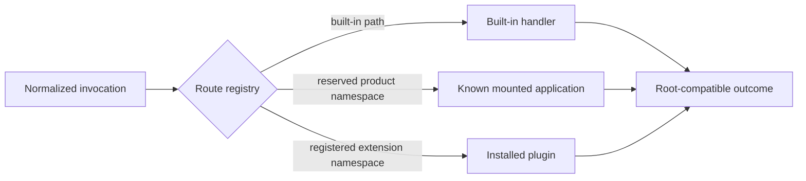

# Plugins And Mounted Applications

`bijux-cli` supports two extension relationships with different ownership and
trust models. Mounted applications are known product integrations described by
the official product registry or an in-process `ProductMount`. Plugins are
operator-installed extensions described by a plugin manifest and registry
record. They share root routing laws, but they are not interchangeable.

## Ownership Boundary

| Concern | Mounted application | Plugin | Root runtime |
| --- | --- | --- | --- |
| product semantics | owning application | plugin implementation | not owned |
| namespace declaration | official registry or `ProductMount` | plugin manifest | validates and reserves |
| installation state | owning distribution | plugin registry and source path | discovers and diagnoses |
| execution | application binary or `BijuxApp` | Python callable or external executable | routes and normalizes |
| output contract | root-compatible application envelope | structured result or native process streams | renders final outcome |
| trust | named Bijux product boundary | local code-execution decision | no sandbox claim |

The root runtime owns whether a route is valid and how its result reaches the
caller. It does not absorb the product or plugin implementation into
`bijux-cli`.

## Namespace Law

`routing::RouteRegistry` is the canonical collision authority. It starts with
built-in paths, built-in aliases, reserved runtime roots, official product
namespaces, and official aliases. A plugin namespace or alias is accepted only
when its normalized root collides with none of them and with no installed
plugin route.

Namespace checks must remain:

- deterministic regardless of plugin discovery or installation order;
- case-normalized before comparison;
- strict for aliases as well as canonical names;
- closed against built-in route roots, not only complete command strings;
- explicit on unknown and ambiguous routes.

Do not add a special-case parser branch for an application or plugin. Add
metadata to the owning contract and let the registry perform one resolution.

## Mounted Application Contract

`contracts::ProductMountDescriptor` is the serialized application descriptor.
`sdk::ProductMount` is the crate-native builder used by embedded Rust
applications. The official registry in
`contracts/official_product_namespace_registry.json` reserves known product
names and aliases even when their binaries are not installed.

A mounted application owns its command tree and business behavior. The root
runtime owns:

- namespace and alias validity;
- host-version compatibility checks;
- discovery diagnostics and binary selection;
- forwarding of arguments;
- conversion into the shared result and render contract.

`sdk::BijuxCliHarness` exercises mounted Rust applications without spawning a
process. It is a parity harness for root routing and envelopes, not a second
runtime with weaker namespace rules.

## Plugin Lifecycle And Execution

A plugin manifest declares identity, namespace, compatibility, kind, and
entrypoint. Installation records the source-linked manifest in the plugin
registry. It does not copy arbitrary plugin source into an isolated managed
store. Moving or deleting the manifest root can therefore make an installed
record broken.

Before execution, the runtime verifies lifecycle state and refuses disabled,
broken, or incompatible plugins. Supported execution paths are:

- Python or delegated callables, loaded with a supported Python interpreter
  from the manifest root;
- external executables, resolved from the governed entrypoint path.

Both paths have bounded execution time. External process streams and exit
status remain native process evidence. Python callables must return the
structured bridge envelope. Malformed structured output is a contract failure,
not an empty success.

## Trust And Effects

Plugin metadata validation protects routing and registry integrity. It does
not isolate plugin code from the current user account. A plugin can use the
filesystem, network, and credentials available to its process. The runtime
limits inherited environment variables and applies a timeout, but neither
control is a security sandbox.

Mounted applications also execute outside the root runtime's semantic
ownership. Their official status identifies product ownership; it does not
make delegated code effect-free.

## Change Guide

| Change | Primary owner | Required proof |
| --- | --- | --- |
| reserve or rename an official namespace | product registry contract | registry schema, alias, and route-law tests |
| add plugin manifest data | plugin contracts and manifest parser | schema compatibility and lifecycle tests |
| change route precedence | routing registry | built-in, app, plugin, alias, and order-independence tests |
| change Python plugin invocation | plugin runtime | interpreter, timeout, envelope, and failure tests |
| change mounted-app result shape | SDK and output contracts | harness, binary, and Python parity tests |
| change install or registry writes | plugin operations and registry | locking, rollback, corruption, and recovery tests |

Focused verification lives under `tests/routing.rs`,
`tests/architecture.rs`, and `tests/integration/cli/plugins/`. A change that
crosses the Python mounted-app boundary also requires the
`bijux-cli-python` app SDK and runtime parity tests.
