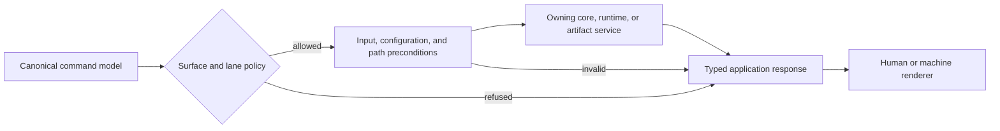
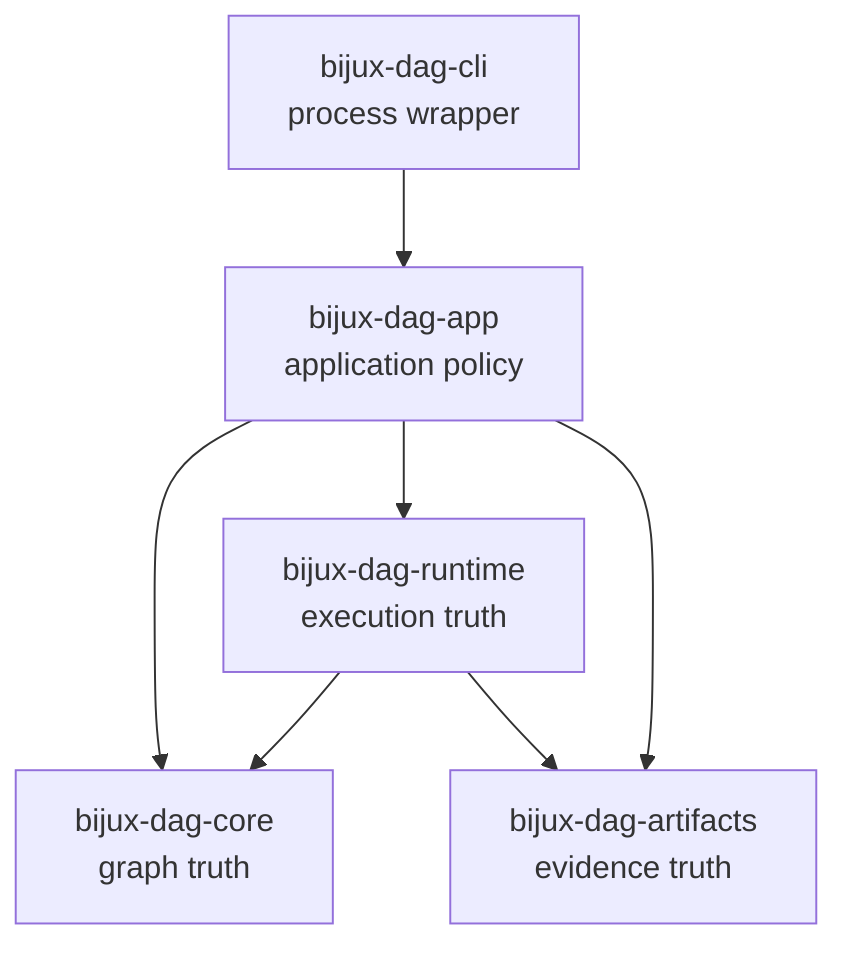

# `bijux-dag-app` Architecture

`bijux-dag-app` is the application boundary for DAG commands. It converts
operator intent into domain calls and converts domain results into typed
responses. It does not reimplement graph, runtime, or artifact semantics.

## Request Flow

`dag_command` builds the supported Clap command. `dag_run` accepts parsed
matches, enforces access policy, runs one command workflow, and returns process
status without owning process startup.

## Source Boundaries

| Area | Responsibility |
| --- | --- |
| `commands` | command model, config surface, output contracts, lane policy, reference generation |
| `routes` | preconditions, service selection, command-family orchestration, response shaping |
| `read` and `write` | explicit application input and destination boundaries |
| `graph` | graph command workflows through core |
| `cache` and `replay` | cache, replay, and diff workflows through runtime/evidence services |
| `inspect` | status, run views, failure, integrity, and comparison reports |
| `repair` | proposals and explicit retained-evidence repair operations |
| `explain`, `format`, `migrate` | focused application services |

Routes should make orchestration visible but remain thin. A route may validate
command-specific preconditions, call domain owners, and shape a response. It
must not contain a second scheduler, graph validator, hash algorithm, or
artifact serializer.

## Dependency Direction

The app depends on core, runtime, and artifacts. `bijux-dag-cli` depends on the
app as a process wrapper. The app must not depend on CLI, testkit, or
maintainer packages.

The app may compose these owners into one command response. It may not copy
their validation, execution, or evidence algorithms into route handlers.

## Stable Surface

`stable` exposes command construction, command execution, config resolution,
run lookup, and selected inspection operations for embedding. `prelude`
provides common imports. Feature-gated command report and workspace
compatibility helpers remain experimental.

The installed command has an additional compatibility surface: command names,
arguments, lane visibility, generated reference, output envelopes, and exit
behavior.

## Extension Decisions

- Add command syntax to the command model and generated reference authority.
- Put route access in surface policy, not scattered environment checks.
- Put domain behavior in the owning downstream crate.
- Represent command results with typed response data before rendering.
- Keep preview and inspection read-only.
- Require explicit destination and mutation disclosure for writes.

## Verification

`crate_boundary_contract.rs`, `service_boundary_contract.rs`,
`public_api_contract.rs`, command routing contracts, and no-panic operator
contracts protect this architecture.
