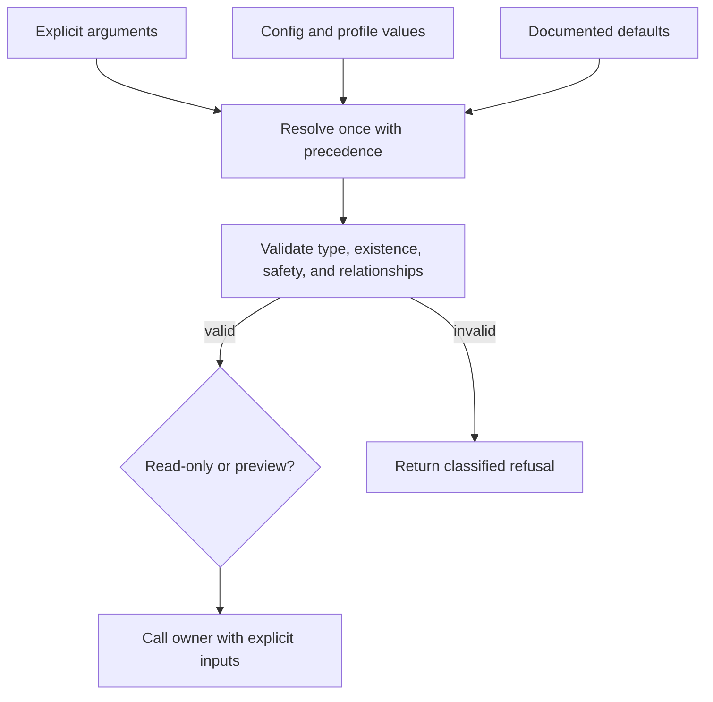

# Route Authoring

A `bijux-dag-app` route is the application adapter between one canonical
command model and one owned workflow. This guide defines how to add or change a
route without duplicating graph, runtime, artifact, or rendering authority.

## End-To-End Shape

```mermaid
flowchart LR
    model["commands/cli_model.rs"]
    lane["commands/surface_policy.rs"]
    dispatch["lib.rs dispatch"]
    route["routes/*_routes.rs"]
    checks["preconditions and path resolution"]
    service["owned app or domain service"]
    response["typed response"]
    output["human, JSON, or quiet output"]
    status["preserved ExitCode"]

    model --> lane --> dispatch --> route --> checks --> service --> response --> output --> status
```



Each stage has one responsibility. A route coordinates the stages; it does not
become another authority for command grammar, domain semantics, persistence,
or process termination.

## Establish Ownership First

Before editing the command tree, classify the requested behavior:

| Behavior | Owning location |
| --- | --- |
| graph parsing, validation, identity, or planning invariant | `bijux-dag-core` |
| scheduling, attempts, cache, replay, or backend execution | `bijux-dag-runtime` |
| retained schema, lineage, integrity, import, or export | `bijux-dag-artifacts` |
| command-level composition and response shaping | `bijux-dag-app` |
| process startup, completion generation, or final termination | `bijux-dag-cli` |

If the implementation requires a graph algorithm inside a route or direct
artifact layout knowledge inside a renderer, the ownership decision is wrong.

## Define The Command Once

`commands/cli_model.rs` is the command-tree authority. Add the command,
arguments, conflicts, defaults, help, and value parsing there. Do not recreate
an argument inventory in the route, reference generator, or test.

Then classify access in `commands/surface_policy.rs`:

- **stable** routes appear in the default operator surface;
- **experimental** routes require an explicit path but no environment opt-in;
- **simulated** routes require `BIJUX_DAG_ENABLE_SIMULATED=1`;
- **internal** routes require `BIJUX_DAG_ENABLE_INTERNAL=1`.

Source presence and hidden help are not sufficient access controls. Discovery
and execution must agree with the selected lane.

## Add Explicit Dispatch

The dispatch match in `src/lib.rs` identifies exactly one route handler for
the parsed command. Keep command-family routing in a focused module under
`src/routes/`.

A route handler may:

- extract typed command values;
- resolve configuration and command-level policy;
- validate explicit path and mutation preconditions;
- call an application service or domain owner;
- map the result into typed response data;
- select the governed output representation.

A route handler must not:

- parse raw argv again;
- implement graph or scheduler rules;
- guess failure class from message text when a typed error exists;
- print partial JSON before the outcome is known;
- mutate state for help, preview, inspection, or denied access;
- convert a refused or failed operation into success.

## Resolve Inputs Before Effects

Use the shared precondition and path helpers rather than ad hoc filesystem
checks. Distinguish files, directories, run directories, run identifiers,
artifact identifiers, cache roots, and destinations.



An invalid explicit value is not replaced by a lower-precedence default.
Mutating routes reject traversal, source/destination overlap, and ambiguous
run lookup before calling an owner. Preview paths must be derived through the
same resolution path used for execution.

## Preserve One Outcome

Build typed result data before rendering. Human and JSON modes can differ in
presentation, but they must agree on:

- success or failure;
- command and entity identity;
- causal failure class;
- retained evidence and output paths;
- whether state changed;
- final exit status.

`--quiet` suppresses allowed presentation; it does not alter execution or
status. JSON output is one complete envelope on stdout. Diagnostics that are
not part of that envelope belong on stderr.

## Verification Matrix

| Contract | Evidence |
| --- | --- |
| command appears in the intended lane | command-tree snapshot and surface-policy tests |
| denied lanes cannot execute | command-surface routing contracts |
| invalid operator input cannot panic | malformed-input and route-entrypoint no-panic contracts |
| paths are resolved without unintended writes | path preview and focused workflow contracts |
| human and machine outcomes agree | output, error-output, and schema lockstep contracts |
| domain refusal remains visible | owning workflow and failure contracts |
| generated reference matches the model | reference documentation contract |
| stable Rust exposure is intentional | public API contract |

Run the narrow route contract first. A new command family or shared output
change also requires the package suite:

```bash
cargo test --locked -p bijux-dag-app
```

## Review Questions

- Is there one semantic owner below the application layer?
- Is command access explicit and consistent between discovery and execution?
- Are all inputs resolved before effects begin?
- Do preview and execution share path and configuration resolution?
- Can human, JSON, quiet, and failure paths report different outcomes?
- Does every refusal retain its original class and nonzero status?
- Are reference, snapshots, tests, and public docs updated from the same model?
