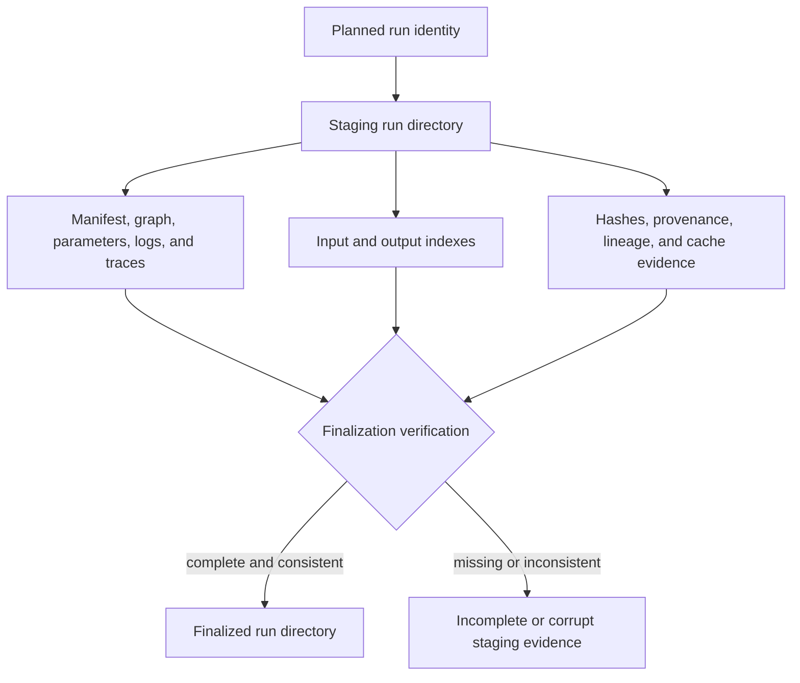
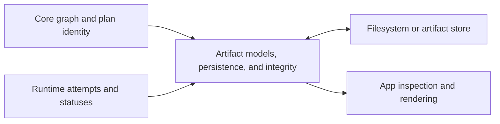

# `bijux-dag-artifacts` Architecture

`bijux-dag-artifacts` owns retained run evidence: filesystem layout, typed
records, integrity proofs, lineage, promotion, retention, and storage
interfaces. It records execution facts but does not decide graph semantics or
schedule work.

## Source Boundaries

| Area | Responsibility |
| --- | --- |
| `storage/models.rs` | manifests, traces, inputs, outputs, provenance, failures, cache records |
| `io` | filesystem paths and artifact-store backends |
| `layout` | normalized paths and platform storage models |
| `integrity` | hashing, indexes, schemas, proofs, lifecycle, cache, run-layout contracts |
| `lifecycle` | lineage snapshots, promotion records, and retention policy |
| `storage/hardening.rs` | atomicity, path, and corruption defenses |
| `lib.rs` | run-directory lifecycle and curated exports |

The crate has deliberate IO. Pure graph interpretation stays in
`bijux-dag-core`; execution orchestration stays in `bijux-dag-runtime`.

## Evidence Flow



Staging evidence is incomplete until finalization. Readers must distinguish it
from a finalized run.

## Authority Rules

Runtime supplies statuses, attempts, adapter identity, and resolved execution
facts. Artifacts defines representation, persistence, hashing, and
verification. Core supplies graph/planner identity without depending on run
layout. App and CLI layers render artifact data without redefining it.

Run paths, manifest fields, schema versions, hash interpretation, identity,
verification results, and lifecycle transitions are compatibility-sensitive.
`stable` is the curated API; feature-gated contracts remain experimental.



The crate records facts supplied by core and runtime using its own persistence
contracts. It does not infer graph validity from files or execution success
from the mere presence of a run directory.

## Extension Decisions

- Add a typed model before writing a new JSON record.
- Put run-relative paths under the canonical layout authority.
- Validate paths before filesystem access.
- Use atomic writes for governed indexes and metadata.
- Record provenance for copy, promotion, deduplication, and import.
- Keep storage capability detection separate from workflow policy.
- Reject unverifiable evidence rather than fabricating completeness.

## Verification

```bash
cargo test --locked -p bijux-dag-artifacts
```
