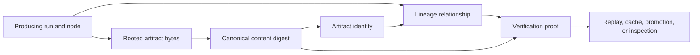

# Integrity And Lineage

Artifact evidence is trustworthy only when identity, bytes, provenance, and
relationships can be checked independently.

## Evidence Chain



No link is interchangeable with another. Equal bytes do not establish the
same producer. A lineage edge does not prove content integrity. A valid digest
does not establish that a required output set is complete.

## Artifact Identity

`build_artifact_identity` binds run, node, output path/name, node fingerprint,
and artifact SHA-256. The canonical identifier includes run, node, path, and
content hash. A compatibility identifier may remain for older consumers but is
not a substitute for content-bound identity.

## Hashing Rules

Files are hashed by bytes. Directories are hashed recursively from sorted
relative paths and child hashes, independent of enumeration order. Symbolic
links and non-regular entries are rejected. Paths use normalized `/`
separators and size accounting uses checked addition.

Changing hash composition or path normalization changes evidence
compatibility.

## Proofs And Corruption

Proofs record expected identity and verification data. Corruption results
distinguish verified, missing, changed, and unverifiable evidence. Repair
cannot relabel changed bytes as verified without new identity and provenance.
Bundle verification checks completeness, not merely one valid file.

## Lineage

Lineage records directed relationships among artifacts. Snapshots support
ancestor/descendant queries, visualization, compact retention views, and
lineage-safe collection. Lineage survives promotion, deduplication, cache
reuse, replay, import/export, retention, and archive operations.

Deduplication may share storage but cannot erase distinct producing run or node
relationships.

## Verification Outcomes

| Observation | Classification | Allowed conclusion |
| --- | --- | --- |
| expected identity, bytes, proof, and required relationships agree | verified | evidence may support its declared consumer |
| governed path or required member is absent | missing | run or bundle is incomplete |
| bytes or canonical directory composition differs | changed | refuse the old identity; create new identity only through a producing operation |
| entry cannot be read or its kind is unsupported | unverifiable | no integrity claim |
| content matches but producer or lineage differs | distinct provenance | deduplication may share bytes, but histories remain separate |
| one bundle member verifies while another required member fails | incomplete bundle | refuse bundle-level verification |

Verification code must preserve these distinctions. Collapsing them into a
boolean would allow missing or unreadable evidence to appear equivalent to
known corruption or verified content.

## Cache And Replay Evidence

Cache decisions record key factors, compatibility context, reuse safety, and
decision. Replay records ancestry and per-node plans. Neither is inferred from
a content hash alone; governing graph, node, environment, adapter, and policy
factors must agree.

## Verification

```bash
cargo test --locked -p bijux-dag-artifacts \
  --test artifact_identity_and_lineage_contracts \
  --test artifact_hardening_contracts \
  --test run_manifest_identity_contracts
```
