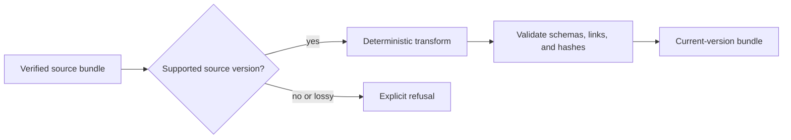

# Artifact Schema Evolution

`bijux-dag-artifacts` persists evidence that must remain interpretable after
the process that created it has exited. Schema evolution therefore covers more
than decoding JSON: readers must preserve integrity, identity, lineage, and the
ability to explain whether a run is complete, replayable, or compatible.

## Schema Families

One run directory contains several independently meaningful contracts:

| Family | Representative evidence | Version authority |
| --- | --- | --- |
| run summary | `manifest.json` | `manifest_version` |
| graph source | `graph.snapshot.json` | graph specification metadata |
| node execution | `nodes/*/trace.json`, attempts, resolved parameters | trace and adapter-output versions |
| artifacts | root and node output indexes | index schema and hash contract |
| lineage | lineage snapshot and promotion records | lineage and promotion schema versions |
| observability | events, timeline, root causes, metrics | event and timeline schema versions |
| directory contract | `run.schema.json` | `RunDirSchemaIndex::schema_version` |

`RunDirSchemaIndex` records the required and optional files and points to the
schemas that interpret them. It is the directory-level map, not a substitute
for each file's own version.

```mermaid
flowchart TB
    index["run.schema.json"]
    manifest["manifest.json"]
    graph["graph.snapshot.json"]
    traces["node traces and attempts"]
    outputs["artifact indexes"]
    lineage["lineage and promotions"]
    events["events and timeline"]

    index --> manifest
    index --> graph
    index --> traces
    index --> outputs
    index --> lineage
    index --> events
```

## Reader Policy

Parsing a Rust structure does not by itself establish compatibility. A reader
must also check the declared version, required files, referential integrity,
hashes, and cross-record identifiers.

Readers may accept older governed versions when a fixture and migration rule
prove that their meaning is preserved. Unknown future versions must be refused
or surfaced as unsupported; they must not inherit the current version's
meaning through Serde defaults.

Defaults support fields that were genuinely optional in the governing
contract. They are not permission to synthesize identity-bearing evidence that
was never recorded.

## Writer Policy

Writers emit the current schema versions and one canonical field shape. A
write is not complete until:

- the record serializes successfully;
- referenced paths remain within the run-directory boundary;
- content hashes and indexes agree;
- durable writes reach their intended location;
- completion markers are written only after required evidence is valid.

Governed JSON writes use atomic durable helpers where the storage backend
supports them. A process failure must leave either the previous valid record or
an explicitly incomplete run, not a truncated record that looks complete.

## Additive And Breaking Changes

An additive field is compatible only when old readers can ignore it safely,
new readers assign one stable meaning when it is absent, and the field does not
silently alter identity or verification. Required evidence, changed field
meaning, enum narrowing, path relocation, and hash-input changes require an
explicit compatibility decision.

| Change | Required treatment |
| --- | --- |
| optional explanatory field | default, omitted-form fixture, maximal fixture |
| new identity or verification input | version review and old-evidence policy |
| renamed field | governed read alias if justified; canonical writer spelling |
| required file or index entry | run-directory schema change and migration rule |
| changed hash algorithm or canonical bytes | new identity contract; never relabel old hashes |
| removed field | prove no supported reader, verifier, replay, or migration path needs it |

## Migration Boundary

Migration transforms retained evidence; it does not rewrite history invisibly.
A migration must record source version, target version, tool version, and the
decision for any field that cannot be represented exactly.



Never mutate the only copy of a source bundle before target verification
passes. If a transformation would discard semantic evidence, refuse it unless
the governing migration contract explicitly permits and records that loss.

## Cross-Crate Responsibilities

`bijux-dag-core` owns the graph snapshot's authored meaning.
`bijux-dag-runtime` owns which execution facts are recorded.
This crate owns the persisted shapes, storage safety, and validation helpers.
`bijux-dag-app` and CLI readers must use these APIs rather than decoding
selected JSON fields into a separate compatibility model.

## Verification

`tests/run_manifest_roundtrip_and_retention_contracts.rs` protects minimal,
maximal, supported, and unsupported manifest fixtures.
`tests/artifact_identity_and_lineage_contracts.rs` protects identity and
lineage. Storage resilience, IO hardening, conformance, and resource contracts
cover path safety, atomicity, completeness, and bounded evidence shape.
Schema migration work must also run the runtime replay and import/export
contracts that consume retained bundles.
