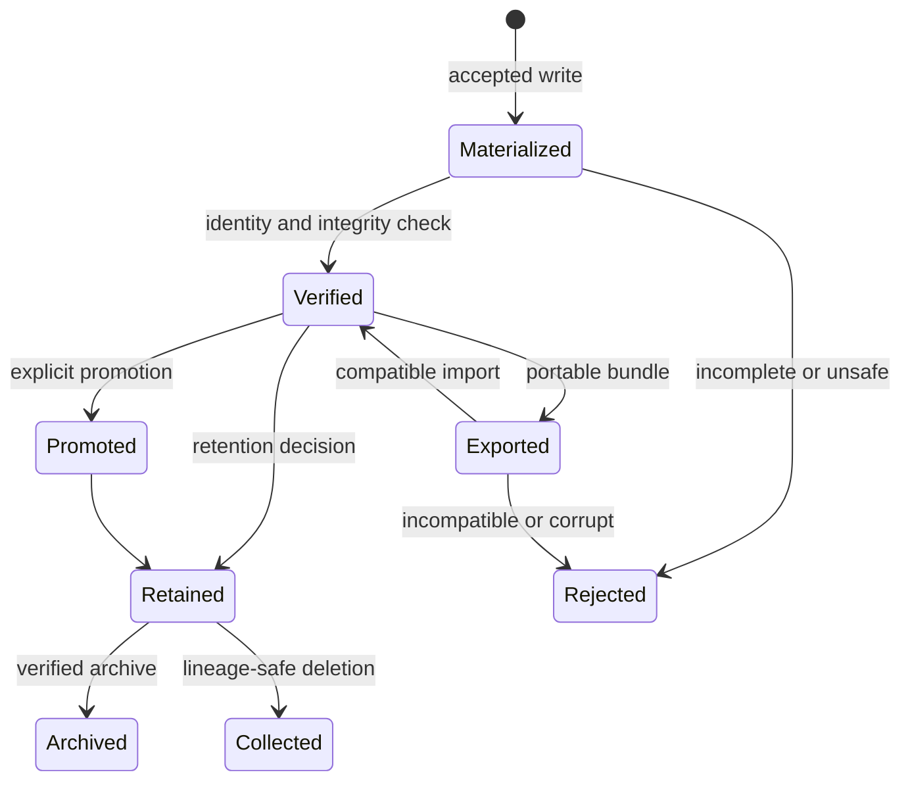

# Storage And Lifecycle

Storage APIs separate evidence semantics from backend capability. Filesystem
and object stores may differ operationally but preserve identity,
verification, provenance, and lifecycle rules.

## Service Boundaries

`RunArtifactStore` and `RunArtifactVerifier` are the core services.
`ArtifactStoreBackend` describes backend operations and capabilities. A
backend cannot claim atomic rename, conditional writes, consistent listing, or
verification it does not provide. Runtime selects workflow policy; this crate
reports support and performs evidence operations.

## Lifecycle Authority



These are evidence states, not storage implementation classes. A backend may
provide different physical operations, but it cannot skip verification or
lineage checks when moving between accepted states.

## Filesystem Safety

Filesystem storage rejects absolute, traversing, non-normalized, symbolic-link,
and escaping paths where regular owned content is required. It creates parents
intentionally, uses atomic metadata replacement, and preserves actionable IO
errors. Tests use isolated directories rather than checkout state.

## Object Storage

Object storage uses the same logical identities and schemas. Backend keys are
transport details. Import, replication, packing, compression, chunking, and
signing preserve canonical identity and lineage. Eventual consistency and
missing conditional operations remain explicit capabilities.

## Capability Decisions

| Backend condition | Required behavior |
| --- | --- |
| atomic replacement is unavailable | use a contract-approved commit protocol or refuse operations that require atomic publication |
| conditional create/update is unavailable | do not claim race-free uniqueness or compare-and-swap behavior |
| listing is eventually consistent | verify required identities directly; do not treat one listing as authoritative completeness |
| symbolic links or traversing paths are encountered | reject them where regular rooted content is required |
| inventory cannot be verified | block collection, destructive retention, and bundle completeness claims |
| cleanup partly fails | preserve the primary evidence and return an actionable lifecycle failure |

Capability declarations are operational inputs. They are not documentation
labels that allow callers to proceed with weaker semantics silently.

## Promotion And Retention

Promotion records source identity, destination environment, and lineage. It
does not rewrite the producing run.

Retention classifies evidence and computes decisions. Collection considers
lineage dependencies and offers explainable dry-run output. Deletion cannot
break retained descendants, replay or promotion provenance, rely on an
unverified inventory, mutate immutable annotations, or bypass retention class.

## Import, Export, And Archive

Portable bundles declare profile, schema, identities, proofs, and lineage.
Import validates compatibility before materialization. Redaction is explicit
policy with an omission/transformation record. Archive verification confirms
profile completeness and integrity before acceptance.

## Verification

```bash
cargo test --locked -p bijux-dag-artifacts \
  --test storage_services_contracts \
  --test artifact_storage_resilience_contracts \
  --test artifact_io_store_hardening_expansion_contracts \
  --test conformance
```
