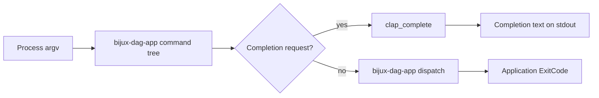
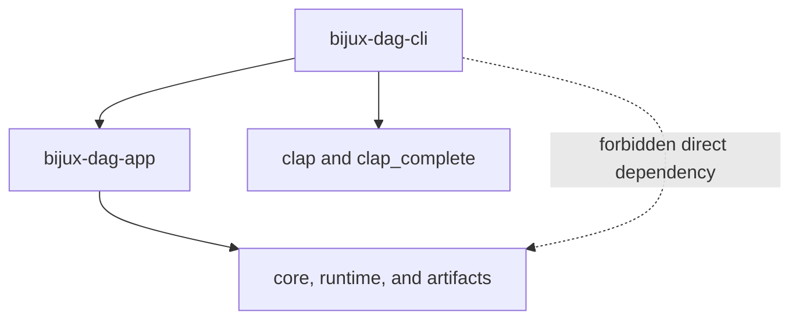

# `bijux-dag-cli` Architecture

`bijux-dag-cli` is the process wrapper for `bijux-dag`. Its architecture is
intentionally small: obtain the application command tree, add process-owned
completion generation, parse arguments, delegate, and return status.

## Entrypoint Flow

The executable does not build an independent DAG command model. Every
non-completion route is parsed from `bijux_dag_app::dag_command` and executed
through `bijux_dag_app::dag_run`.

## Dependency Boundary

Runtime dependencies are limited to:

- `bijux-dag-app` for command behavior;
- `clap` for process parsing;
- `clap_complete` for shell completion output.

The package must not depend directly on graph core, runtime, artifacts,
testkit, or maintainer crates. Needing one of those dependencies indicates
that behavior belongs in the app or its domain owner.

The dotted edge is a prohibited shortcut. The wrapper cannot bypass
application policy even for a command that appears operationally simple.

## Owned Responsibilities

The wrapper owns:

- the binary name `bijux-dag`;
- argument acquisition and parser invocation;
- completion shell selection and generation;
- panic containment at the process boundary;
- returning the application's exit code.

It does not own route policy, rendering, output envelopes, configuration,
graph loading, execution, or evidence.

## Panic Boundary

Operator input should already be no-panic in the app. The process wrapper
still catches an unexpected panic to prevent Rust panic output from becoming a
public command contract. It reports one internal error on stderr and exits
nonzero.

This containment is not a substitute for fixing the panic. Reproductions and
no-panic regression tests belong in the owning app workflow.

## Change Decisions

- Command syntax changes belong in `bijux-dag-app`.
- Process initialization belongs here only when all commands require it.
- Shell-specific completion behavior belongs in the completion branch.
- Output post-processing is forbidden; app output passes through unchanged.
- New runtime dependencies require explicit boundary proof.

## Verification

`contract_surface.rs` protects the installed surface, `routing.rs` checks
delegation, and `smoke_pipeline.rs` checks startup and representative command
flow. App contracts remain the semantic authority.
