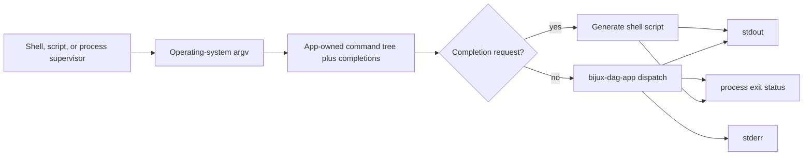
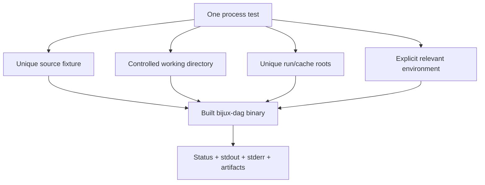

# Installed Binary Contract

The published artifact from `bijux-dag-cli` is the `bijux-dag` process. Its
contract includes more than successful startup: executable identity, argv
parsing, help and completion projections, stream separation, and exit status
must remain coherent with `bijux-dag-app`.

## Process Boundary



The wrapper may select the completion branch because completion generation is
process-owned. Every DAG command delegates to `bijux_dag_app::dag_run`.

## Compatibility Surface

| Surface | Authority | Compatibility expectation |
| --- | --- | --- |
| executable name | `bijux-dag-cli` package metadata | installation produces `bijux-dag` |
| command grammar and help | `bijux-dag-app::dag_command` | wrapper does not maintain a second tree |
| completion command and shells | `src/main.rs` | scripts project the same command tree |
| command semantics and rendering | `bijux-dag-app` | wrapper passes outcomes through |
| stdout and stderr | parser, app, or completion owner | streams are not merged or post-processed |
| process status | parser or `bijux-dag-app` | nonzero outcomes are not normalized to success |
| panic containment | `src/main.rs` | unexpected panic becomes one internal failure |

A change to one row requires review of its consumers. For example, renaming an
argument affects help, completions, generated reference, scripts, and app
tests even though only one command model is edited.

## Invocation Rules

- Parse the operating-system arguments once.
- Do not inspect command names before Clap except through the parsed
  completion branch.
- Do not read user state merely to display help or generate completions.
- Do not retry failed application commands in the wrapper.
- Do not add wrapper-specific aliases that bypass the app command model.
- Do not reinterpret output text to choose an exit status.

Process initialization belongs here only when every command requires it and it
does not change help or completion into stateful operations.

## Stream And Status Matrix

| Outcome | stdout | stderr | Status |
| --- | --- | --- | --- |
| successful human command | app-owned primary output | app-owned diagnostics, if any | zero |
| successful JSON command | one app-owned JSON document | incidental diagnostics only | zero |
| parser refusal | parser-selected output | parser-selected diagnostic | usage-style nonzero |
| application refusal or failure | app-selected representation | app-selected diagnostics | app-selected nonzero |
| completion generation | completion script only | empty unless write fails | zero on success |
| unexpected panic | no invented success payload | one internal-error diagnostic | internal nonzero |

The wrapper does not append context to structured stdout. A process supervisor
must be able to trust status independently of presentation mode.

## Environment And State

The binary inherits application configuration, lane opt-ins, and runtime
environment because those are inputs to app or runtime behavior. The wrapper
does not define alternate precedence.

Help and completion generation must be deterministic from the compiled command
tree. They must not require:

- a current repository checkout;
- user configuration or plugin state;
- an existing run or cache root;
- a network, container engine, cluster, or scheduler;
- write access outside the selected output stream.

## Process-Test Isolation

Tests invoke `CARGO_BIN_EXE_bijux-dag` and capture status, stdout, and stderr.
Each mutating test owns unique temporary graph, run, cache, and replay paths.
Tests must not share a mutable location or depend on the developer's home
directory.



Fallback to `cargo run` can help a local smoke harness locate the binary, but
release-facing package tests should prefer Cargo's exact built-binary path.
Test isolation must hold under parallel execution.

## Release Evidence

Before publishing the package, verify:

- package, binary, and workspace versions agree;
- runtime dependencies remain limited to Clap, completion generation, and the
  app package;
- `cargo install bijux-dag-cli` produces the expected executable;
- default help exposes the intended stable lane;
- every supported completion shell emits nonempty script output;
- representative success, usage failure, application failure, and panic
  containment preserve streams and status;
- app-generated command reference and compatibility fixtures are current.

Focused wrapper verification is:

```bash
cargo test --locked -p bijux-dag-cli
cargo test --locked -p bijux-dag-app --test crate_boundary_contract
```

Command-semantic evidence still belongs to the owning app, runtime, core, or
artifact suite. A green wrapper suite proves the installed boundary, not the
entire DAG product.
