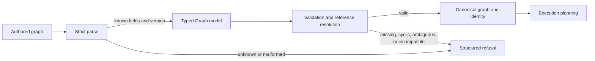

# Graph Model

The `Graph` family is the authored source of truth for workflow structure.
Strict deserialization rejects unknown fields so misspellings and unsupported
semantics cannot be accepted silently.

## Graph Structure

`Graph` contains a specification identifier, optional metadata, typed graph
inputs, an explicit nondeterminism declaration, subgraph definitions and
instances, nodes, and edges. Execution-relevant behavior belongs in typed
fields rather than free-form metadata.

Each `Node` has a stable identifier and `NodeKind`, plus optional semantic
classification. Nodes declare inputs, outputs, params, container settings,
timeout, resources, tags, retries, cache behavior, effects, environment
allowlisting, grouping, trigger rules, branching, and dynamic expansion.

Core owns every transition in this diagram. Runtime receives a valid planned
contract; it does not reinterpret unknown authored fields or repair invalid
references.

`OutputSpec` defines name, relative path, kind, requirement, media type, and
promotion eligibility. Artifact persistence and path hardening belong to
`bijux-dag-artifacts`.

## References

`ParamValue` distinguishes literals from references. `RefSpec` can refer to a
graph input, a named node output, or a governed runtime path variable. Known
path variables are `run_dir`, `work_dir`, `inputs_dir`, `outputs_dir`, and
`cache_dir`. Core validates names; runtime supplies concrete paths.

References are resolved before execution. Missing, ambiguous, cyclic, or
type-incompatible references are validation failures, not runtime defaults.

## Edges And Trigger Rules

Edges describe port dependencies and carry an `EdgeKind`. Trigger rules decide
eligibility after upstream terminal outcomes. Branch contracts identify
selected paths without allowing scheduler order to change graph meaning.

`deterministic_topology_order` produces the same ordering for equivalent valid
graphs. Cycles and missing nodes are errors.

## Composition And Expansion

Subgraphs expand under stable identifier rules and retain exported output
identity. Dynamic expansion documents have an explicit schema version and
deterministic generated node identifiers. Composition rejects collisions and
incompatible specifications rather than renaming authored nodes implicitly.

## Authoring Rules

- Use typed fields for execution semantics.
- Keep node identifiers stable across equivalent source formatting.
- Declare every consumed output through a reference.
- Use exact environment allowlist entries; wildcard patterns are invalid.
- Declare nondeterminism explicitly when semantics require it.
- Treat required-output and cache defaults as serialization compatibility.

## Change Impact

| Change | Required review |
| --- | --- |
| add or change a graph field | strict parse, schema round trip, defaults, canonicalization, and compatibility |
| change identifier or map ordering | graph identity, cache keys, replay, diff, and fixture determinism |
| add a node or output kind | typed validation, planner lowering, runtime support, artifact meaning, and refusal on unsupported paths |
| change reference syntax | parser, type compatibility, cycle detection, path-variable ownership, and diagnostics |
| change composition or expansion | collision rules, generated identifiers, exported outputs, topology, and source attribution |
| change trigger or branch semantics | validation, planning, scheduler eligibility, retained decisions, replay, and comparison |

Model changes are rarely local to serialization. If a field influences
execution or evidence, its identity and downstream compatibility effect must
be explicit before the model is accepted.

## Verification

`schema_roundtrip_contracts.rs`, `node_input_contract.rs`,
`graph_input_schema_contract.rs`, `subgraph_expansion_contract.rs`,
`topology_fuzz_contracts.rs`, and `authoring_examples_contract.rs` are the
principal model authorities.
