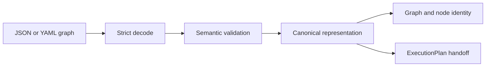

# Graph Serialization And Evolution

`bijux-dag-core` owns the authored graph shape and the deterministic meaning
derived from it. A serialization change is therefore not only a Serde change:
it can alter validation, canonical bytes, graph identity, planner input, cache
behavior, and replay compatibility.

## Compatibility Dimensions

| Dimension | Question |
| --- | --- |
| parse compatibility | Can a previously valid graph still be decoded? |
| semantic compatibility | Does the decoded graph request the same work? |
| canonical compatibility | Do representation-only differences still converge? |
| identity compatibility | Do graph and node fingerprints change only when intended? |
| planner compatibility | Does lowering expose the same execution requirements? |
| diagnostic compatibility | Are invalid graphs rejected with stable, actionable categories? |

A passing deserialization test proves only the first row. Every graph-model
change must classify its effect across all six.

## Strict Input Boundary

Graph-domain structures use `deny_unknown_fields` where authored shape must be
closed. Misspelled or unimplemented fields are errors rather than ignored
metadata. Untagged values are used only where the contract deliberately
accepts more than one representation.

Defaults are compatibility decisions. A default is safe only when omitting the
field has one unambiguous meaning and that meaning remains stable. Adding a
defaulted field can still alter canonical output or identity, so the change
must be tested with both omitted and explicit forms.

Aliases are narrower than defaults. They permit a named historical spelling;
they must not create two indefinitely emitted representations. Writers should
emit the canonical spelling even when readers accept a governed alias.

## Version Ownership

The authored graph carries specification metadata, while several subordinate
contracts carry their own schema identifiers. Version identifiers describe
data meaning, not the current crate version.

Do not:

- derive graph schema support from the Cargo package version;
- accept an unknown version because the current Rust struct happens to parse;
- change an existing version's meaning after fixtures have been published;
- use a version bump to hide an unintended canonical or identity regression.

When a new version is required, define the reader policy, current writer
version, migration direction, and removal condition together. Unsupported
future versions must fail explicitly rather than being interpreted as the
latest known shape.

## Canonicalization And Identity

Canonicalization removes representation differences such as map order or
omitted default syntax. It must preserve every execution-relevant distinction.
Graph and node fingerprints are downstream compatibility surfaces, not
incidental hash outputs.

Classify a model change before implementation:

| Change | Expected identity effect |
| --- | --- |
| formatting or key order | none |
| explicit value equal to governed default | none |
| display-only metadata excluded by contract | none |
| command, dependency, input, resource, trigger, or output semantics | affected graph or node identity changes |
| planner-only derived representation with unchanged meaning | graph identity stable; planner contract reviewed separately |

If identity changes intentionally, update compatibility fixtures and explain
why existing cache or replay evidence must not be reused. Never refresh
fingerprint snapshots without reviewing the semantic difference.

## Reader And Writer Rules

- Readers validate syntax, declared version, references, topology, resources,
  and semantic invariants before planner lowering.
- Writers emit one canonical field spelling and deterministic collection
  ordering.
- Round trips preserve meaning; they need not preserve insignificant source
  formatting.
- Older accepted inputs may normalize to the current canonical shape.
- Lossy migration requires explicit refusal unless the governing migration
  contract names and tests the information loss.
- Runtime observations never participate in graph migration or
  canonicalization.

## Change Procedure

1. Identify the owning graph type and every canonical, identity, planner, and
   diagnostic consumer.
2. Decide whether the change is additive, interpretive, or breaking.
3. Update strict schema fixtures for valid, omitted, explicit, unknown, and
   malformed input.
4. Update canonical and fingerprint fixtures only after semantic review.
5. Verify planner lowering and downstream runtime assumptions.
6. State old-reader/new-writer and new-reader/old-writer behavior.
7. Update the specification or migration authority when serialized meaning
   changes.

## Verification

`tests/schema_roundtrip_contracts.rs` and `tests/serde_roundtrip.rs` protect
serialized shape and round trips. `tests/compat.rs` owns versioned canonical
and fingerprint fixtures. `tests/canonical_contract.rs`,
`tests/graph_identity_contract.rs`, and the identity property contracts protect
normalization and identity. Planner contracts must also pass whenever a model
change reaches `ExecutionPlan`.
