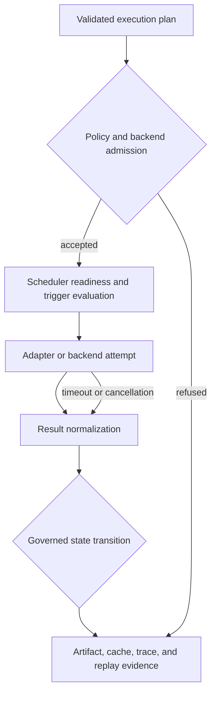
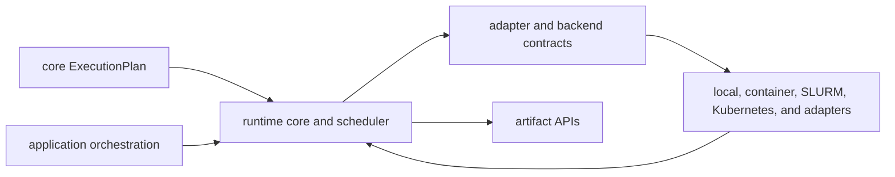

# `bijux-dag-runtime` Architecture

`bijux-dag-runtime` turns a core `ExecutionPlan` into governed node attempts
and retained run evidence. It owns effects and state transitions while relying
on `bijux-dag-core` for graph meaning and `bijux-dag-artifacts` for evidence
formats.

## Runtime Flow



No layer may skip directly from process status to successful node completion.
Required outputs, timeout, cancellation, policy, and persistence also govern
the terminal result.

## Source Boundaries

| Area | Responsibility |
| --- | --- |
| `runtime_core` | engine, scheduler, state machine, contexts, planning handoff, invariants |
| `adapters` and `builtins` | adapter API, registry, conformance, shell, container, transform, Python, HTTP |
| `backend` | capability contracts and local, container, Kubernetes, SLURM execution |
| `policy` | runtime decisions and explainable policy traces |
| `cache` | key factors, proof, storage, and reuse explanation |
| `replay` | source eligibility, comparison, and replay classification |
| `artifacts` | orchestration through `bijux-dag-artifacts` |
| `diagnostics` | events, timelines, invariants, and operator evidence |
| `internal` | clocks, selectors, IO, identity controls, and non-public analysis |

`simulated_platform` is deliberately visible and deliberately non-stable. Its
types support modeling and evidence work, not production-readiness claims.

## Dependency Direction

Runtime depends on core and artifacts. App may depend on runtime. Runtime must
not import app, CLI, testkit, or maintainer packages.

Adapter and backend implementations depend on runtime-owned contracts; the
scheduler must not branch on implementation-private status. Artifact
orchestration depends on artifact APIs rather than reproducing serialized
models.



Implementations report through runtime-owned contracts. They do not expose
private statuses that the scheduler must interpret by concrete type.

## Stable Surface

`bijux_dag_runtime::stable` is the long-lived execution lane. `prelude` groups
common planning and execution imports without widening stability. Broad
crate-root re-exports support focused compatibility usage but remain hidden
from the primary docs lane.

The `experimental-public-api` feature exposes contracts outside the stable
promise. Modeled distributed, federated, high-availability, and remote-worker
types are not stable operator services.

## Extension Decisions

- Put scheduler and lifecycle changes in `runtime_core`.
- Add execution integrations through adapter or backend contracts.
- Add retained shapes in `bijux-dag-artifacts` first.
- Keep ambient values behind clocks, environment, IO, or backend boundaries.
- Record every policy factor that can alter execution or reuse.
- Refuse unsupported capability rather than approximating it.

## Verification

Use focused state, scheduler, adapter, cache, replay, and backend contracts for
bounded changes. Broad runtime semantic changes require:

```bash
cargo test --locked -p bijux-dag-runtime
```
