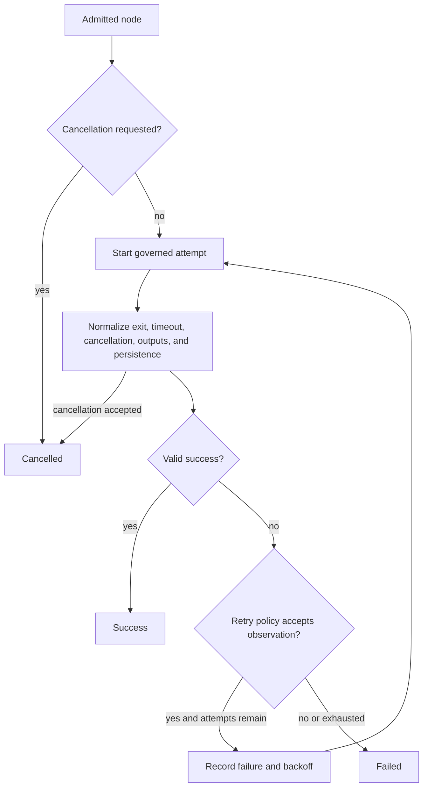

# Failure, Retry, And Cancellation

`bijux-dag-runtime` turns backend and adapter observations into one
controller-owned execution result. Failure handling is part of the retained
product contract: a non-zero process status, timeout, cancellation, missing
output, or persistence error must remain distinguishable after the run ends.

## Classification Boundary

`FailureInfo` records a class, kind, code, message, and optional structured
details. The stable operator classes are:

| Class | Meaning | Typical action |
| --- | --- | --- |
| `user` | authored input or required output is invalid or missing | correct the graph, parameters, or produced files |
| `policy` | execution is denied or cannot satisfy policy | change policy or requested capability explicitly |
| `infrastructure` | backend, adapter, process, storage, or host dependency failed | restore the dependency and evaluate retry safety |
| `execution` | an admitted attempt failed while performing work | inspect attempt streams and adapter evidence |
| `timeout` | a governed queue, attempt, or run budget expired | change work or timeout policy; do not treat late success as accepted |

Cancellation is a terminal node status and a causal record rather than a
`FailureClass`. It identifies operator, run-budget, or controller intent that
stopped acceptance of work.

## Attempt Decision Flow

Every attempt remains in `attempts.json` with its own streams, timestamps,
failure, and scheduled backoff. A later success does not erase earlier failed
attempts.

## Success Acceptance

Process exit zero is necessary for process-backed nodes but is not sufficient.
The controller also evaluates:

- whether timeout or cancellation was already accepted;
- whether required outputs exist and satisfy path rules;
- whether adapter output can be decoded and validated;
- whether retained trace and artifact writes complete;
- whether terminal transition invariants still hold.

A late exit after timeout remains a timeout. A command that exits zero without
its declared output is a user-class failure. A successful backend status with
unverifiable evidence is not a successful node.

## Retry Semantics

Retry policy combines maximum attempts, backoff strategy, failure classes,
timeout policy, and optional exit codes. The default retryable classes are
transient execution and timeout observations. User failures are not made
retryable merely because attempts remain.

Before permitting a retry, the runtime must answer:

1. Is the normalized failure class eligible?
2. Does an explicit exit-code rule apply?
3. Does timeout policy permit another attempt?
4. Is the attempt budget unexhausted?
5. Can the operation repeat without violating its idempotency and side-effect
   contract?
6. Has cancellation or run timeout superseded retry?

Retrying is a new attempt, not a state reset. Backoff and decision reasons
belong in retained events so an operator can explain elapsed time and final
status.

## Cancellation Semantics

Cancellation is checked before launch, during supported execution, after
attempt return, and before success acceptance. Current local runs can receive
operator cancellation through interrupt handling or a versioned
`run.stop-request.json`.

Completed nodes remain completed. Running work is terminated according to its
backend guarantee, and nodes that can no longer start receive explicit
cancelled evidence. The final manifest records a cancellation cause and node
counts that agree with traces.

Unix subprocess execution uses process-group cleanup. Other platforms and
external schedulers have documented best-effort or backend-specific
termination boundaries. A cancellation request is not proof that every
descendant process or remote job stopped immediately.

## Failure Propagation

Dependency and trigger rules decide downstream behavior. A parent failure or
cancellation does not automatically turn every descendant into the same
failure. The controller records whether a node was skipped, cancelled, or
executed under its trigger rule, together with the parent outcomes that caused
the decision.

Run status is derived from accepted terminal node states and run-level causes.
It must agree with retained node counts, timelines, and completion markers.

## Recovery And Resume

Resume may reuse completed evidence or rerun incomplete work according to the
declared mode. It cannot manufacture a missing attempt, overwrite the causal
failure, or interpret an ambiguous staging directory as complete.

Cache and replay refusal are also explicit outcomes. Falling back to fresh
execution may be a separate operator decision, but it must not be reported as
a successful cache hit or replay.

## Verification

`tests/runtime_failure_contracts.rs` protects classification and evidence.
`tests/runtime_retry_contracts.rs` covers attempt retention, backoff,
eligibility, exit-code rules, timeout policy, and exhaustion.
`tests/runtime_cancellation_contracts.rs` covers interrupt and stop-request
causes, preserved completed work, cancelled descendants, audit, and timeline
ordering. State-machine, scheduler-invariant, execution-resilience, and
artifact contracts must also pass when terminal acceptance changes.
