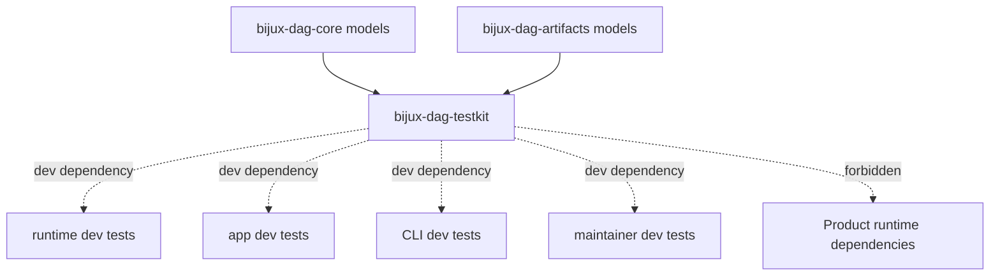
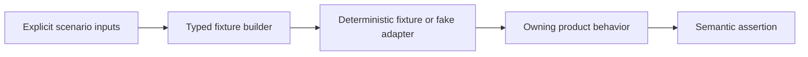

# `bijux-dag-testkit` Architecture

`bijux-dag-testkit` is private shared test infrastructure. It centralizes
deterministic setup and semantic assertions needed by multiple DAG crates
without becoming a product dependency or alternate implementation.

## Source Boundaries

| Path | Responsibility |
| --- | --- |
| `lib.rs` | fixture loading, graph shapes, evidence registry, assertions, command harness, corruption builders |
| `workflows.rs` | complete workflow fixtures and run-directory snapshots |
| `fake_adapter.rs` | deterministic adapter scenarios and recorded executions |
| `product_scenarios.rs` | typed cross-crate scenario reports |

Package-specific setup remains in the package that owns the test. A helper
belongs here only when multiple owned suites need the same semantics.

## Dependency Direction

Testkit depends on core and artifacts for public model types. Runtime, app,
CLI, and maintainer crates may use it only as a development dependency.
Product source, release builds, package archives, and installed commands must
not require it.

The testkit may construct valid and deliberately invalid domain values. It
must not define what those values mean; product contract tests remain the
authority.



The testkit can share construction and assertions across test targets. It must
never appear in a published package's normal dependency graph.

## Determinism

Helpers receive paths and scenario inputs explicitly. They do not read
developer home state, wall-clock time, random mutable globals, installed
tools, or network resources unless a caller deliberately injects that
dependency.

Normalization removes only fields declared non-semantic by product contracts.

## Failure Style

Convenience loaders may panic with precise fixture context because they are
test setup. Checked loaders return actionable errors where tests need to assert
failure behavior. Neither silently substitutes a nearby fixture.

Corruption helpers name the fault they introduce so expected product refusal
remains reviewable.



Expected results are asserted after the owning product interprets the fixture.
Encoding the expected product decision inside the fixture builder would create
an alternate implementation and invalidate the test.

## Extension Decisions

- Prove at least two consumers before adding shared setup.
- Prefer typed core/artifact models over hand-built JSON.
- Keep synthetic fixtures distinct from repository release evidence.
- Add a checked variant when failure itself is under test.
- Update all consumers when canonical fixture meaning changes.
- Never add production workarounds to make a fixture pass.

## Verification

```bash
cargo test --locked -p bijux-dag-testkit
```

Every semantic helper change also requires at least one consuming package
contract proving the intended product behavior.
