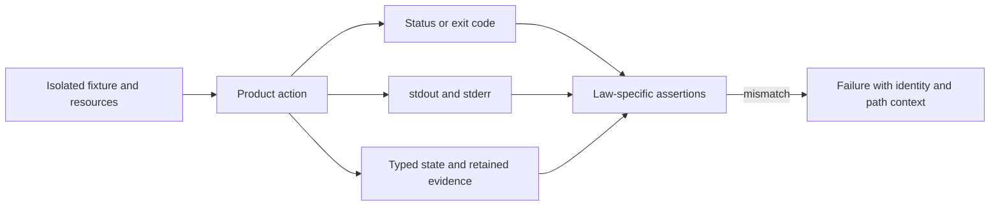

# Assertions And Harnesses

Shared assertions encode durable product laws, not convenient output
equivalence. Harnesses isolate process and filesystem state while preserving
the complete observable result.

## Observable Result

A harness captures observations; it does not decide which observations prove
success. The consuming test must assert every output required by the contract
and preserve distinctions among process status, streams, typed response, and
retained state.

## Manifest Assertions

`assert_manifest_eq_normalized` converts manifests to structured values and
normalizes timestamps declared non-semantic for the comparison. It preserves
run identity, graph identity, configuration, node counts, failures, adapter
data, cache, replay, provenance, and output summaries.

Do not add a field to normalization merely because a test became unstable.
First establish that the owning artifact contract declares it non-semantic.

## Trace Assertions

`assert_trace_completeness` checks exact node coverage, non-empty status, and
valid time ordering. `assert_node_event_sequence` checks lifecycle order.

When product states expand, assertions should express the allowed state
machine rather than delete unexpected states from comparison.

## Command Harness

`run_cli_in_temp_repo` executes a caller-supplied command in an isolated
directory, directs Cargo products into that directory's `artifacts/target`,
and returns exit code, stdout, and stderr.

The harness does not infer success, combine streams, or parse envelopes. The
consuming test owns those assertions.

## Corruption Builders

`create_corrupted_run_dir` creates a minimal run and applies a named fault:
truncated manifest, missing trace, or unsafe output index. Tests must assert
the product's precise refusal or recovery behavior.

Unknown corruption names should not be used to imply a fault was introduced.
Add a named implementation and consumer together.

## Assertion Failure Modes

| Tempting shortcut | Defect introduced | Correct approach |
| --- | --- | --- |
| normalize a newly unstable field | hides an undeclared identity or determinism change | prove the field non-semantic in the owning contract first |
| assert only exit success | misses corrupt or incomplete retained evidence | assert status plus contract-bearing outputs and state |
| merge stdout and stderr | erases stream ownership and automation behavior | retain and assert streams independently |
| compare debug strings for typed data | couples tests to incidental formatting | parse and compare the semantic structure |
| reuse checkout paths across tests | creates order and concurrency sensitivity | allocate per-test directories and resources |
| accept any error for a corruption case | permits wrong refusal classifications | assert the precise error class and evidence state |

## Assertion Quality

- Compare typed or parsed structures for semantic data.
- Compare raw text only when wording or byte shape is the contract.
- Preserve order when order is meaningful.
- Assert both status and evidence, not one alone.
- Include identity and path context in failures.
- Keep update modes explicit and disabled by default.

## Verification

Testkit unit contracts cover loaders, builders, fakes, and registry access.
Consuming app/runtime/artifact tests remain mandatory because a helper passing
its own test does not prove the product uses it correctly.
