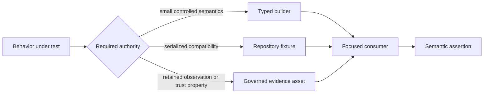

# Fixtures And Builders

Fixtures provide stable inputs for graph, runtime, artifact, app, and CLI
contracts. Builders make semantic intent visible and reduce irrelevant JSON
noise.

## Choose A Fixture Source

Use the least authoritative fixture that proves the behavior. A small typed
builder is preferable for one graph law; a checked-in serialized fixture is
appropriate when byte shape or compatibility matters; governed evidence is
required when ownership, provenance, or a retained trust property is the
subject.

## Graph Builders

Canonical builders cover chain, diamond, fan-out, disconnected, retry,
timeout, cache, replay, branch, and failure shapes. Workflow builders add
map/reduce, semantic map/reduce, and branch/join examples.

Builders use `bijux-dag-core` types and `SPEC_VERSION`. Defaults must be valid
under current product contracts. A newly required field is added explicitly;
the testkit must not conceal it with a stale compatibility default.

## Repository Fixtures

Loaders resolve paths relative to a supplied crate manifest directory and the
workspace root. Text, JSON, and typed loaders report the requested path on
failure.

Evidence assets are resolved through the repository registry by stable asset
identifier. Unknown identifiers are errors. Compatibility path remapping may
locate governed evidence under its current domain root, but cannot select a
different asset.

## Synthetic And Evidence Data

Synthetic fixtures test semantics under controlled inputs. Evidence fixtures
represent retained repository observations. A synthetic run must not be
described as release proof, and an evidence file must not be rewritten merely
to simplify a unit test.

The registry records evidence ownership and consumers. Tests should use asset
identifiers where that relationship matters.

## Ownership Rules

| Asset | Owner | Change rule |
| --- | --- | --- |
| typed graph builder | testkit | preserve valid current defaults and expose scenario-specific semantics |
| serialized contract fixture | consuming product contract | update only with schema/compatibility intent and refusal coverage |
| governed evidence asset | evidence registry and owning domain | update through the registered producer and consumer governance |
| snapshot | owning consumer | review semantic differences; update mode does not approve them |
| corruption fixture | testkit plus refusal consumer | name one fault precisely and assert the product classification |

## Snapshot Builders

`collect_run_dir_snapshot` captures the governed run layout. Snapshot updates
must be explicit and reviewed. `update_or_assert_snapshot` supports the
repository's update mode but does not decide whether changed output is valid.

Snapshot paths are derived from caller-supplied manifest roots. Generated
snapshots belong in governed fixture locations only when they are intentional
contract assets.

## Builder Review

- Name graph nodes and outputs by their role in the scenario.
- Keep only factors needed by the contract under test.
- Avoid command strings that depend on host-specific tools.
- Make failure and corruption intent explicit.
- Preserve deterministic collection order.
- Add both validity and refusal consumers for boundary fixtures.

## Verification

`fixture_builder_contract.rs`, `fixture_loader_contracts.rs`, and
`evidence_access_contracts.rs` protect construction and lookup. Graph and
artifact consumers prove that fixture semantics still match product behavior.
