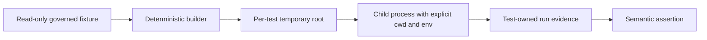

# Hermetic And Parallel Tests

`bijux-dag-testkit` supports tests that can run concurrently without changing
one another's inputs or observations. Parallel safety comes from isolated
resources and explicit dependencies, not from forcing the complete suite onto
one worker.

## Resource Ownership

| Resource | Safe default | Unsafe pattern |
| --- | --- | --- |
| filesystem output | one `TempDir` or unique child per test | repository-relative fixed output |
| repository fixtures | read-only lookup from supplied workspace root | mutating a shared fixture in place |
| process working directory | set on the child `Command` | changing process-global current directory |
| environment | set or remove values on the child process | mutating process-global environment during parallel tests |
| Cargo output | test-owned `CARGO_TARGET_DIR` when invoking Cargo | every harness writing the repository target concurrently |
| runtime run root | test-owned temporary directory and unique run id | a shared `runs/` directory |
| network | loopback endpoint with OS-assigned or reserved test port | fixed port shared by the suite |
| time and randomness | injected clock, retained seed, or bounded predicate | exact wall-clock equality or unseeded behavior |

The repository fixture is an input. Every mutable derivative belongs under the
test-owned root.

## Workspace Fixtures

Fixture loaders derive the workspace root from an explicit manifest directory
and fail with the requested path when data is absent or malformed. Tests may
read these governed assets concurrently.

If a scenario needs to modify a fixture, copy it into a temporary directory
first. Do not use a global lock to legitimize source-tree mutation by an
ordinary test. A lock protects one process only and still leaves interrupted
runs, other test binaries, and developer commands exposed to the mutation.

## Commands And Processes

`run_cli_in_temp_repo` gives a command its own current directory and
`artifacts/target`. A specialized harness should preserve the same properties:

- pass the working directory to `Command::current_dir`;
- configure environment on the child command;
- capture stdout, stderr, and exit status separately;
- bound execution and terminate owned children;
- never assume a command succeeded because it produced output;
- clean up through temporary-directory ownership.

Tests that send process-wide signals or install global handlers are exceptional.
Keep their critical section narrow and document why process isolation is not
available. Do not serialize unrelated fixture, parser, or assertion tests with
them.

## Environment Discipline

Rust environment mutation affects the whole test process. Prefer APIs that take
configuration explicitly. When testing environment precedence itself, isolate
the behavior in a child process whose complete environment is constructed by
the test.

Do not rely on a developer's `HOME`, credentials, Git configuration, current
directory, or executable search path. Supply a test home and explicit tool
paths, or assert an honest skip/refusal when an external integration is the
subject of the test.

## Golden Updates

`update_or_assert_snapshot` is read-only unless
`BIJUX_UPDATE_GOLDENS=1`. Golden update mode is a maintainer action:

- run a focused owner-approved test selection;
- do not run update mode concurrently;
- inspect semantic changes before commit;
- run the same selection again with update mode disabled;
- never enable update mode in CI or an ordinary full suite.

A failing snapshot is evidence to review, not permission to normalize another
field or overwrite every golden.

## Fakes And Time

Fakes receive outcomes from the test and record calls in test-owned state.
They must not consult wall-clock time, ambient environment, or mutable static
registries unless that dependency is the behavior under test.

Timing assertions use causal ordering and bounded ranges. A retry test may
prove that the second attempt started after the governed backoff; it should not
require an exact scheduler timestamp. Randomized tests retain their seed in the
failure output.

## When Serialization Is Legitimate

Serialization is justified only for an inherently process-global resource that
cannot be moved behind an explicit boundary, such as signal-handler ownership
inside one test binary. The serialization group must:

- name the resource it protects;
- include only tests that actually touch that resource;
- restore state even on failure where possible;
- remain narrower than a package or suite;
- have a removal path when the production boundary becomes injectable.

Suite-wide single-thread execution is not an acceptable substitute for
resource ownership.

## Review Checklist

Before sharing a helper, verify that:

1. every writable path descends from a caller-owned root;
2. fixture and evidence registries are read-only;
3. child process cwd, environment, timeout, and target directory are explicit;
4. failure output identifies the resource and expected invariant;
5. snapshot update behavior is disabled by default;
6. two concurrent calls cannot choose the same mutable path;
7. cleanup does not remove another test's data;
8. normalized assertions preserve semantic identity and ordering.

## Verification

`tests/fake_adapter_harness_contract.rs` uses independent temporary roots for
each harness. `tests/fixture_loader_contracts.rs` and
`tests/evidence_access_contracts.rs` prove deterministic read-only lookup.
Consuming runtime and application suites remain responsible for demonstrating
that their own output roots, process controls, and environment setup satisfy
the same parallel-safety rules.
