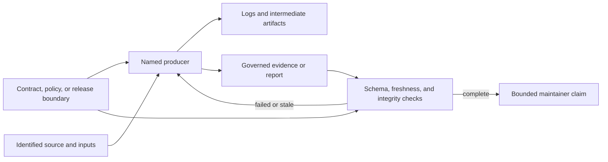

# Evidence And Reports

Reports describe repository or product state. Evidence supports a claim with
identified source, scope, producer, and integrity. Neither becomes a product
contract merely because it is checked in.

## Evidence Record

Evidence records carry stable identity, status, strength, ownership, source,
and consumer mapping. Identifiers are validated and resolved through governed
registries. Missing or unknown assets are explicit failures.

Evidence strength distinguishes modeled, synthetic, observed, and stronger
verification forms where defined by schema. A weaker record cannot satisfy a
stronger claim by relabeling.

## Evidence Pipeline

Intermediate output may help diagnose a producer without becoming repository
authority. Only the governed destination, its final producer status, and its
verification can support the resulting claim.

## Report Families

Maintainer reports cover:

- repository and package health;
- runtime command, route, config, and state surfaces;
- Python bridge, packaging, and parity;
- evidence inventory, audit, staleness, matrix, and exports;
- release status, readiness, gaps, notes, and intentional differences;
- documentation and Rust API health;
- maintainer cockpit summaries.

Reports query owned inputs. They do not infer hidden success when evidence is
missing.

## Generated Output

A governed generated file has:

- one discoverable producer;
- explicit source inputs;
- deterministic ordering and formatting;
- a stale-output or regeneration contract;
- a reviewable destination;
- semantic review before commit.

Intentionally variable fields such as generation time must be isolated and
documented. Generated drift is not accepted automatically.

Transient logs, diagnostics, and local reports go under `artifacts/`.
Checked-in reports under `docs/reports`, specifications, contracts, or other
governed paths require explicit ownership.

## Destination Decisions

| Output | Destination | Commit rule |
| --- | --- | --- |
| local console, trace, benchmark, or diagnostic | `artifacts/` | do not commit |
| reusable product evidence input | governed `evidence/` path | commit with registry ownership and consumer checks |
| executable behavior or schema authority | `docs/spec/` or machine contract path | commit with implementation and enforcing tests |
| revision-comparable observation | `docs/reports/` | commit only when producer, freshness, and retention reason are identifiable |
| public explanation of evidence | owning handbook | explain scope and limits; link to authority rather than copying generated data |

## Machine And Human Reports

Machine reports use the maintained envelope and schema. Human reports use the
maintainer text style. Both identify command, scope, and outcome.

Rendering cannot change status or discard failed components. Partial and
advisory scope is visible in both forms.

## Evidence Integrity

- Verify registry ownership and consumer coverage.
- Validate schema before consuming a record.
- Preserve source commit or input identity where required.
- Detect stale and missing outputs separately.
- Do not treat file presence as proof of successful generation.
- Keep synthetic scenarios distinct from release observations.
- Preserve failed evidence rather than overwriting it with an empty success.

## Determinism And Concurrency

Generators must write through per-run intermediate paths and publish governed
output only after complete success. Concurrent tests or commands must not
share mutable report files unless the file itself is the serialized contract
under test and access is explicitly coordinated at that narrow boundary.

Stable ordering, atomic replacement where supported, and complete terminal
status are part of report correctness. Serializing an entire test suite to
hide shared-path races is not a durable generator design.

When a producer fails, preserve its diagnostics under `artifacts/` and leave
the last valid governed output unchanged. A partial file must not replace
reviewable evidence.

## Verification

`evidence_access_contracts.rs`, registry/schema/governance contracts,
control-plane suite contracts, report-specific generator tests, and stale
output checks are the primary authorities.

Every generator change requires a clean intentional diff of its governed
output or proof that no governed output changed.
