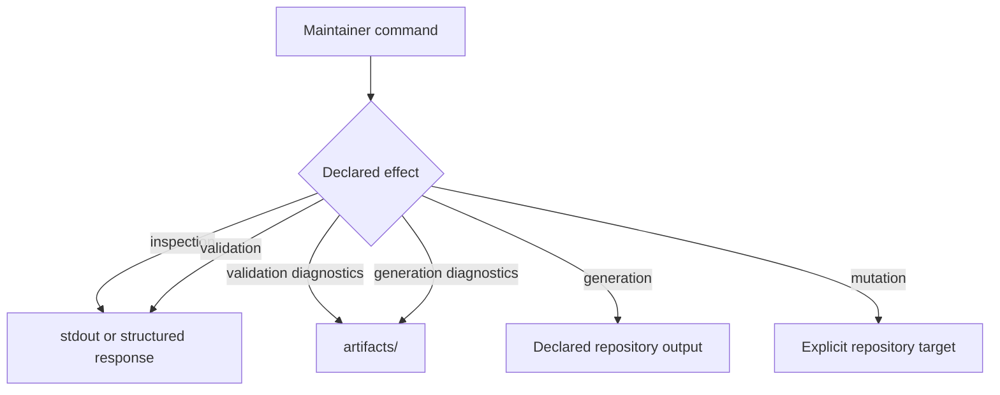

# Governed Outputs And Write Boundaries

`bijux-dev` observes repository state, validates contracts, and generates
reviewable evidence. Those operations have different write authority. A
maintainer command must make its effect visible before execution and must not
turn a validation failure into an unreviewed source-tree mutation.

## Effect Classes

| Effect | Allowed writes | Source-tree behavior |
| --- | --- | --- |
| inspection | none | read-only |
| validation | transient diagnostics under `artifacts/` | governed files unchanged |
| generation | named governed outputs plus transient diagnostics | only declared destinations |
| mutation | explicit repository target named by the command | deliberate and separately reviewed |

The effect belongs to the command contract, not to how a caller happens to use
the output. Redirecting inspection stdout into a file does not make the command
a governed generator. Conversely, a command that writes `docs/reports` is a
generator even if its name starts with `check`.

## Path Classes

Transient output includes logs, local reports, compiled tools, temporary
repositories, command captures, and failed-generation diagnostics. It belongs
under the repository `artifacts/` root.

Governed output includes reports, registries, schemas, generated references,
and evidence that review or contract tests compare across revisions. Each
destination needs one discoverable producer and a stale-output check.

Synchronized organization standards are not local generator targets.
`.bijux/shared/` and synchronized `.github/` content remain owned by the
upstream standards workflow.

## Generator Contract

A governed generator must define:

| Property | Required answer |
| --- | --- |
| producer | Which binary and command regenerates the file? |
| inputs | Which source files, schemas, runtime observations, or baselines are read? |
| destination | Which exact repository-relative paths may change? |
| determinism | Which fields are stable, sorted, or intentionally variable? |
| failure | What remains on disk when generation cannot complete? |
| freshness | Which test or check detects stale output? |
| review | What semantic difference should a reviewer evaluate? |

A file path embedded in source is not sufficient producer documentation when
multiple commands can write it. Consolidate ownership or make delegation
explicit.

## Safe Generation Sequence

1. Validate arguments, repository root, source inputs, and destination
   ownership before writing.
2. Compute the complete output in memory or a test-owned temporary path.
3. Validate schema, references, ordering, and internal consistency.
4. Replace the governed destination only after complete validation.
5. Run the freshness check against the written result.
6. Preserve non-zero status and diagnostics if any required destination fails.
7. Review the semantic diff before commit.

For a multi-file evidence family, partial replacement is unsafe when readers
require a consistent set. Generate into a staging directory, validate the
family, then promote the complete set or leave the previous set intact.

## Atomicity And Durability

High-value governed JSON and contract records should use atomic replacement
when the filesystem supports it. Direct `fs::write` is acceptable for
test-owned or transient output, but it can truncate an existing governed file
if generation is interrupted.

The current package contains both shared report writers and specialized
generators, and not every existing generator uses atomic replacement. Treat a
direct write to a governed path as a review risk: either move it behind a
validated atomic writer or document why interruption cannot leave a plausible
partial result.

Atomic replacement does not make a logically incomplete multi-file set safe.
Family-level validation is still required.

## Determinism

For identical declared inputs, a generator should emit identical semantic
content. Use sorted maps and rows, stable identifiers, normalized repository
paths, and explicit schema versions.

Generation timestamps are justified only when observation time is itself part
of the evidence. Keep them out of identity and drift comparisons where
possible. Do not use current time, temporary path, host name, process ID, or
iteration order as accidental report content.

If a report depends on an external tool or environment:

- record the tool identity or version needed to interpret the result;
- make unavailable capability a visible refusal or incomplete result;
- do not substitute empty success;
- preserve the command status and streams under `artifacts/`.

## Concurrency

Two generators must not write the same governed destination concurrently.
Prefer one owning command over a broad process-global lock. A generator invoked
by parallel tests writes to a caller-supplied temporary root; tests compare the
result with checked-in output after generation.

Read-only validation may run concurrently with other readers. It must not run
against a half-written family, which is another reason to promote generated
sets atomically.

## Generated And Curated Evidence

Generated reports are reproduced by code. Curated ledgers are edited by
reviewers against named evidence. A command may validate a curated ledger but
must not silently delete unresolved rows or rewrite reviewer conclusions to
make a gate pass.

When generated and curated content share a directory, their ownership remains
file-specific. Directory placement does not authorize a generator to rewrite
its neighbors.

## Failure Discipline

On generator failure:

- return non-zero;
- retain the last valid governed output when possible;
- write diagnostics and candidate output under `artifacts/`;
- identify every destination that was not refreshed;
- do not update a freshness marker, checksum, or success report;
- do not weaken the consumer test or remove missing rows.

A generated file existing after failure is not evidence that it is current.

## Verification

Generator tests should use temporary repository roots and assert exact
destination changes, stable second-run output, malformed-input refusal, and
no writes outside the declared boundary. Evidence-access, evidence-governance,
schema, report, source-reference, and stale-output contracts protect the
repository-wide consumers.

Before committing governed output, run the focused generator test, its
freshness check, and `git diff --check`, then inspect both the generated diff
and any source change to the producer.
