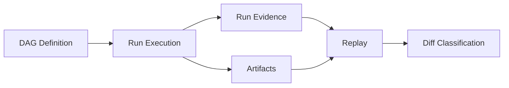

# What Is Bijux Dag

Explain what bijux-dag is, what problem it solves, and why its deterministic model matters.

This is the first technical entrypoint for new readers. It defines the system identity and its problem space before command details or architecture internals.

## Explanation
Bijux-dag is a deterministic workflow runtime and contract-driven control surface for DAG computation. It is designed for teams that need to explain run behavior precisely, compare outcomes reliably, and move workflows across environments without losing attribution.

The practical shorthand "Git for computation graphs" means:
- graph definitions are explicit, inspectable, and comparable
- run outcomes can be traced to defined inputs and graph structure
- replay and diff are first-class system operations, not afterthought scripts

In concrete terms:
- DAG definition in bijux-dag plays the role of a tracked "state description"
- run identity and artifact identity play the role of stable references
- replay and diff provide "what changed" and "why it changed" workflows

This is intentionally not a scheduler megaplatform. Bijux-dag focuses on deterministic control loops around execution rather than broad orchestration feature breadth.

Modern pipeline operations often degrade because they are opaque and drift-prone:
- hidden mutable state changes behavior over time
- retries and reruns are hard to reason about
- output differences are visible, but causes are unclear
- operations teams cannot confidently answer "what changed and why"

Bijux-dag addresses this with deterministic pipeline control:
- explicit graph and execution semantics
- identity-backed run and artifact modeling
- replay and diff as core workflow primitives
- inspect surfaces for debugging and verification

How this compares to common orchestration ecosystems:
- Airflow-class tools optimize broad scheduling and ecosystem integration; bijux-dag optimizes deterministic replay and contract-grade comparability.
- Dagster-class tools optimize software-defined data workflows and asset modeling; bijux-dag keeps the primary center of gravity on graph/run/artifact identity and strict diffability.
- Nextflow-class tools optimize domain-specific execution ecosystems (for example, scientific pipelines); bijux-dag targets a general deterministic DAG control model with explicit runtime contracts.

The difference is emphasis, not value judgment. Bijux-dag chooses narrower scope to make guarantees sharper.

Determinism is central because it converts workflow operation from guesswork to controlled analysis.
Deterministic behavior improves:
- repeatability: the same inputs and graph produce stable behavior
- debuggability: divergences are attributable, not mysterious
- trust: guarantees can be documented, tested, and verified

Execution mental model:
1. define a DAG with explicit node dependencies.
2. execute a run that materializes run evidence and artifacts.
3. inspect outputs and state.
4. replay from known context.
5. diff baseline and candidate evidence to classify equivalence or drift.

## Examples


```bash
# Execute a pipeline
bijux-dag run --dag ./examples/basic.dag.json

# Validate behavior with replay
bijux-dag replay --run-id RUN_20260309_001

# Classify differences between runs
bijux-dag diff run --left RUN_20260309_001 --right RUN_20260309_002
```

```text
Artifact lineage example:
graph_id: g_44a...
run_id: r_9f1...
node_id: test
artifact_id: a_712...
```

```text
Replay outcome example:
baseline run: r_9f1...
candidate replay: r_9f2...
classification: equivalent
```

```text
Diff outcome example:
graph: equivalent
run: drift (reason: NODE_EXIT_NONZERO:test)
artifact: drift (reason: ARTIFACT_HASH_MISMATCH)
```

## Guarantees
- Bijux-dag treats replay, diff, and inspect as core product behavior.
- Deterministic control is a system objective, not optional guidance.
- The product framing in this document is aligned to runtime and specification sections.

## Common Wrong Assumptions
- "Deterministic" does not mean identical wall-clock timing on every backend.
- "Git for computation graphs" does not imply feature parity with Git commands or storage model.
- A successful run does not prove cross-environment portability without replay/diff validation.

## Limitations
- "Git for computation graphs" is a conceptual analogy, not feature parity with Git.
- Determinism does not imply universal backend or environment equivalence.
- This document does not define low-level contracts; those are covered in specification docs.

## Related
- `docs/01-introduction/02-mission.md`
- `docs/01-introduction/03-design-principles.md`
- `docs/01-introduction/04-core-concepts.md`
- `docs/06-specification/01-dag-model.md`
