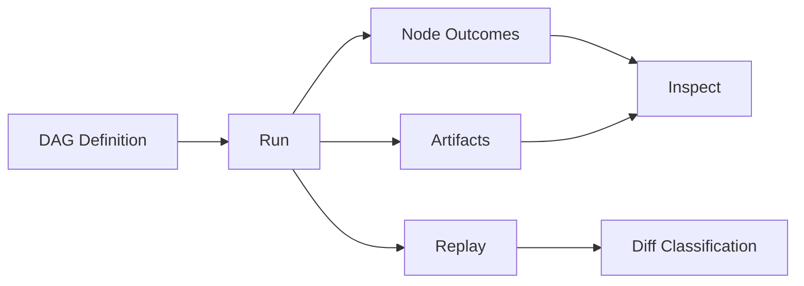

# Core Concepts

Provide a practical conceptual map for operating and understanding bijux-dag.

This document establishes the primary objects and relationships used throughout user guides, CLI reference, and specification docs.

## Explanation
The system can be understood as a five-part control loop:
1. define a DAG (what may run, and in what dependency order).
2. execute a run (what actually happened this time).
3. persist artifacts and run evidence (what was produced and observed).
4. inspect evidence (what succeeded, failed, or drifted).
5. replay and diff (whether behavior stayed equivalent over time).

Primary concepts:

DAG
- The formal dependency graph of work.
- Contains nodes and dependency edges.
- Must be acyclic to be valid.
- Describes execution constraints, not runtime outcome.

Node
- The smallest executable unit in a DAG.
- Declares execution intent and dependency requirements.
- Produces zero or more artifacts plus a terminal node outcome.

Dependency edge
- A directed relationship from prerequisite node to dependent node.
- Defines legal scheduling order.
- Enables parallelism where no dependency path exists.

Run
- One concrete execution instance of one DAG definition.
- Has a run identity, lifecycle state, node outcomes, and evidence.
- Is the unit used for inspect, replay, and run-level diff.

Artifact
- Persistent output with lineage to producing node and run.
- Carries artifact identity and hash-backed comparability signals.
- Is the unit used for output-level comparison and portability workflows.

Identity model
- Graph identity: "which definition state was executed."
- Run identity: "which execution instance produced this evidence."
- Artifact identity: "which canonical output object is this."

Replay
- Re-execution and validation against a baseline run or graph context.
- Answers: "did equivalent intent produce equivalent classified outcomes?"

Diff
- Structured comparison across graph, run, or artifact scope.
- Answers: "where did behavior diverge, and how is divergence classified?"

Inspect
- Read-only introspection of run/artifact/evidence state.
- Answers: "what happened during this run and why?"

Relationship boundaries:
- DAG is definition; run is execution.
- Run is execution context; artifact is output unit inside that context.
- Replay verifies repeatability; diff classifies differences.
- Inspect is diagnosis; it does not modify run/artifact state.

Mental model for operators:
- If a run fails, use inspect first.
- If behavior changed, use diff to locate scope.
- If confidence is needed, use replay to validate stability.
- If outputs must move, use artifact/bundle portability workflows with explicit boundaries.

## Examples
```text
Typical workflow concept flow:
Graph definition -> Run execution -> Artifact production -> Inspect diagnostics -> Replay validation -> Diff analysis
```



```text
DAG -> Run -> Artifacts lifecycle:
1) DAG v1 is authored and validated
2) run r_100 executes DAG v1
3) artifact a_77 is produced by node transform in r_100
4) run r_101 replays DAG v1
5) diff compares r_100 vs r_101 to classify equivalence or drift
```

## Guarantees
- Core concepts are defined once and reused consistently.
- Concept boundaries here are aligned with specification section structure.
- Concept relationships are explicit enough to map user actions to system behavior.

## Limitations
- This document is conceptual, not a contract specification.
- Field-level schemas and algorithms are defined in specification docs.

## Related
- `docs/01-introduction/05-terminology.md`
- `docs/06-specification/01-dag-model.md`
- `docs/06-specification/02-run-model.md`
- `docs/06-specification/03-artifact-model.md`
- `docs/06-specification/07-replay-semantics.md`
