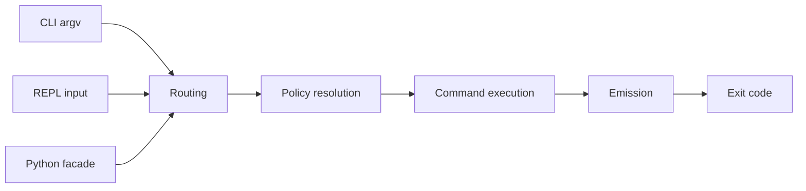
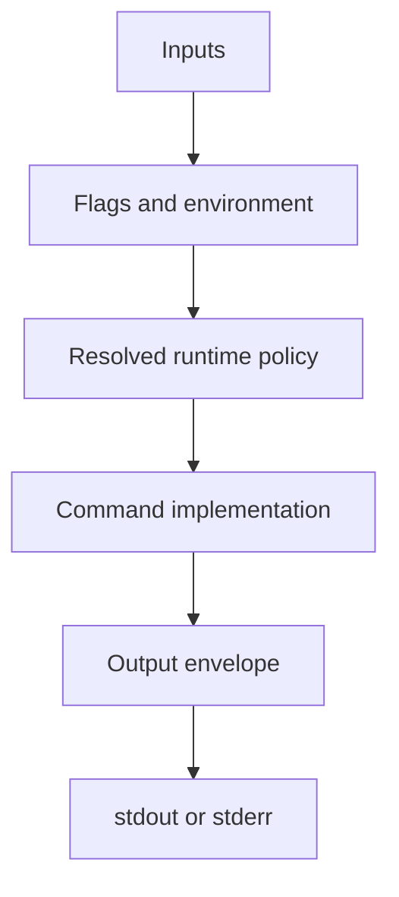

# Command Model

## Mental Model

Think about Bijux as one execution pipeline with several entry surfaces. The
important question is not whether a command came from the CLI, REPL, or Python
package. The important question is whether it passed through the same runtime
law.

## Stable Ideas

- flags should resolve deterministically
- command execution should not depend on hidden mutable globals
- output formatting belongs to the shared emission layer, not to each command
- CLI and REPL should describe the same command world

## Practical Consequence

If you are debugging behavior, ask these questions in order:

1. What route was selected?
2. What policy was resolved from flags, config, and environment?
3. What command logic ran?
4. What output envelope was emitted?
5. What exit code was produced?

## Where This Matters

This model is why Bijux is suitable for automation. It reduces the amount of
surface-specific reasoning users need to do once the command set grows.

## Read Next

- [Limits And Guarantees](limits-and-guarantees.md)
- [Execution Pipeline](../10-architecture/execution-pipeline.md)
- [Routing And Surfaces](../10-architecture/routing-and-surfaces.md)
