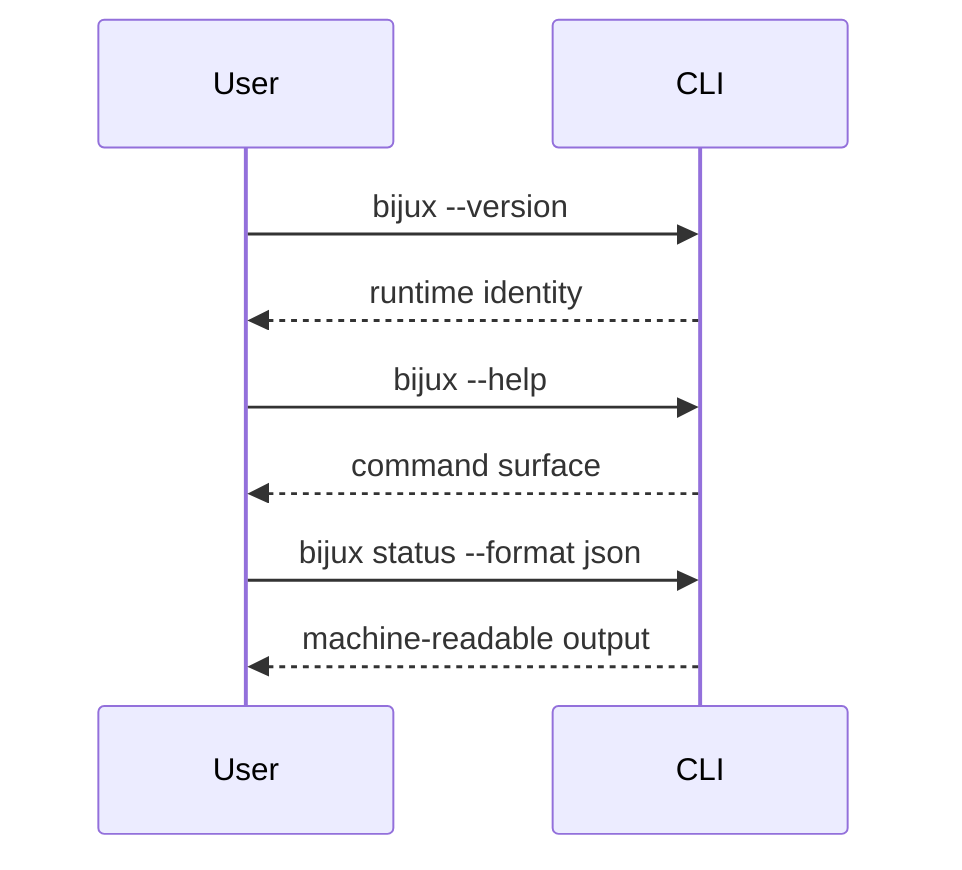
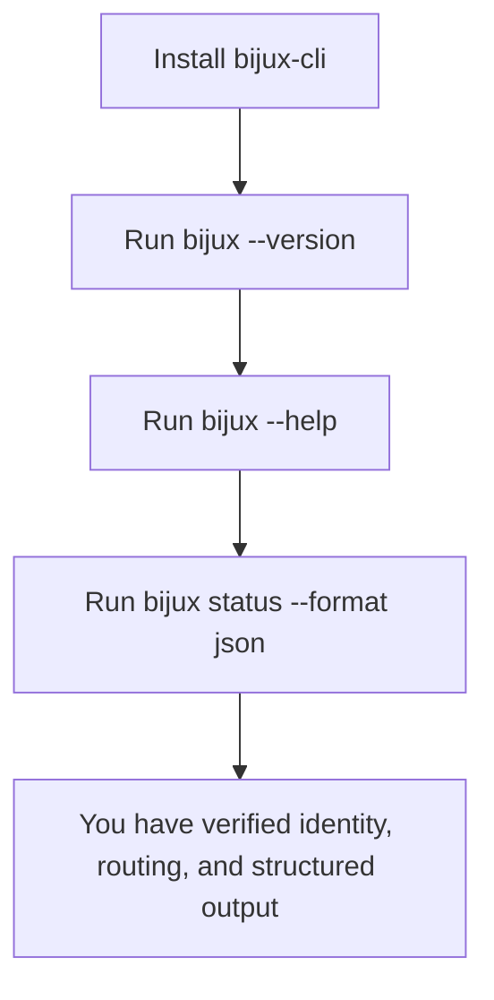

# First Run

## Goal

Use this page when you want the shortest honest verification that the installed
runtime works.





## Minimal Verification

Run these commands:

```bash
bijux --version
bijux --help
bijux status --format json --no-pretty
```

## What Each Step Proves

- `bijux --version` proves the installed entrypoint resolves and reports runtime
  identity
- `bijux --help` proves routing and help generation are available
- `bijux status --format json --no-pretty` proves normal command execution and
  structured output emission

## What This Does Not Prove

These commands do not prove:

- plugin lifecycle behavior
- configuration file workflows
- REPL operation
- release-channel compatibility beyond the installed package you are running

## If Any Step Fails

Go to:

- [Install and verify](../02-getting-started/install-and-verify.md)
- [Installation and recovery](../02-getting-started/installation-and-recovery.md)
- [Command surface](../06-reference/command-surface.md)
- [Testing and evidence](../05-development/testing-and-evidence.md)

## Read Next

If the runtime works, continue to [Getting started](../02-getting-started/index.md)
or return to [Command Model](command-model.md).
