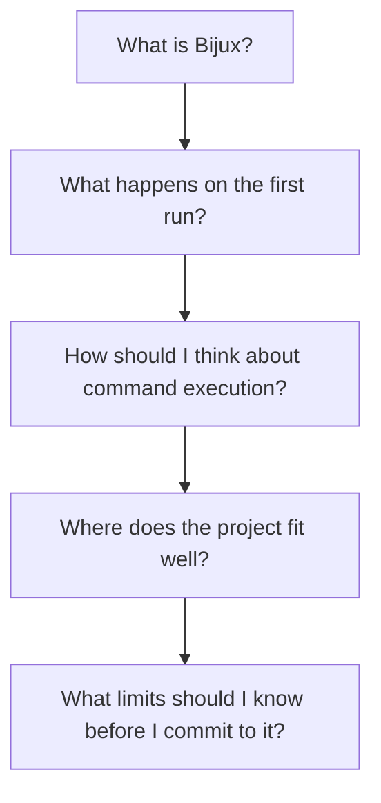
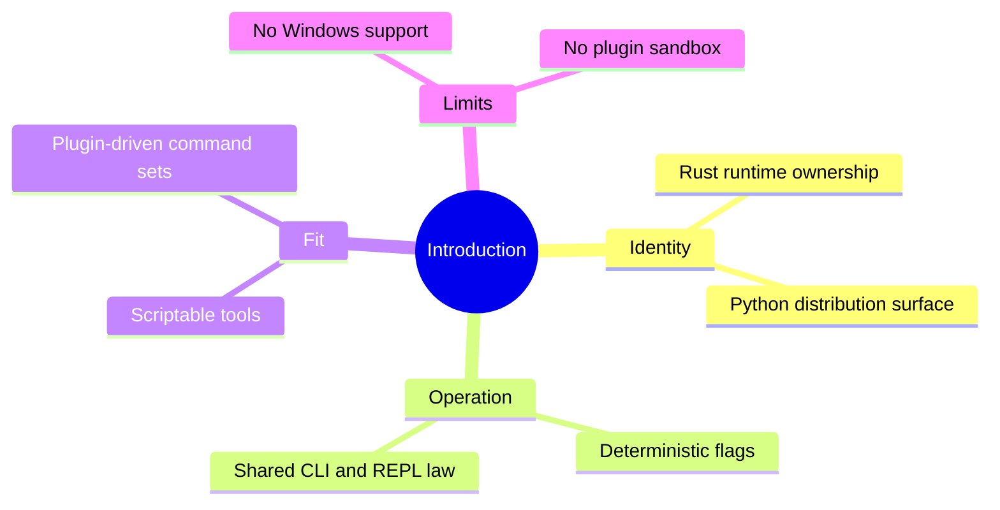

# Introduction

## Purpose

This section is the shortest honest path to understanding what `bijux-cli` is,
what it promises, and where it currently stops.

## Read This Set In Order

1. [What Bijux Is](what-bijux-is.md)
2. [First Run](first-run.md)
3. [Command Model](command-model.md)
4. [Limits And Guarantees](limits-and-guarantees.md)

## Writing Standard

These pages are intentionally narrow:

- they describe the current system, not an aspirational roadmap
- they prefer clear limits over broad claims
- they link into deeper guides and architecture only after the basics are clear

## Next Step

If you already know you want installation details, go to
[First Run](first-run.md). If you need the deeper system map, continue to
[System Overview](../10-architecture/system-overview.md).
