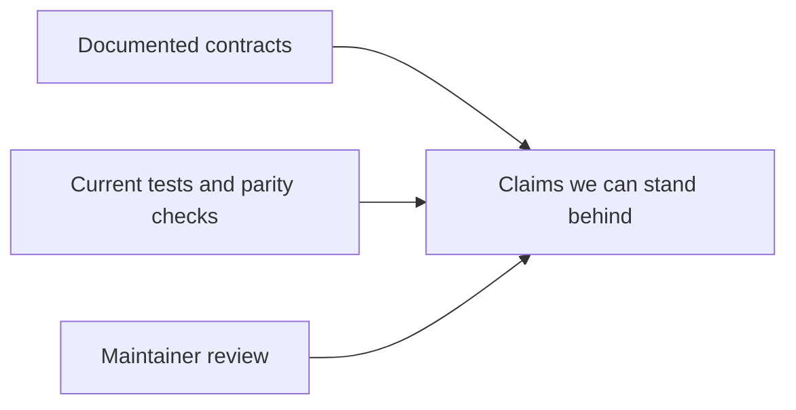
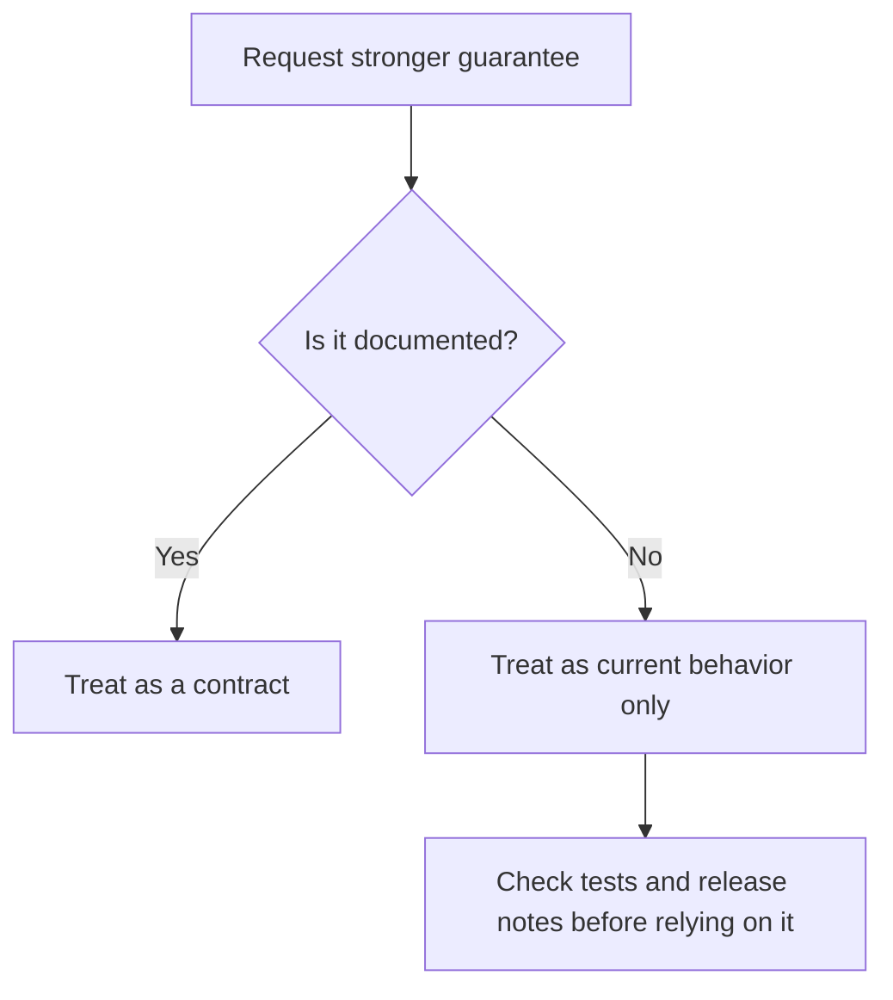

# Limits And Guarantees

## What We Can Claim

This project should earn trust by being specific about what is guaranteed and
what is merely current behavior.

## Where Bijux Fits Well

Bijux is a strong fit when you need:

- deterministic behavior in scripts and CI
- a command surface that will grow over time
- plugin support without pretending plugins are sandboxed
- explicit output and compatibility review

Bijux is a weak fit when you need:

- a tiny throwaway CLI with almost no policy surface
- Windows support today
- hard isolation between host and plugin code

## Current Hard Limits

- Windows is not a supported platform
- plugins are not sandboxed
- not every internal crate API is a public compatibility commitment
- release quality is judged from live tests and maintainer checks, not from
  checked-in artifact snapshots

## Current Guarantees

- the repository treats the Rust runtime as the behavioral source of truth
- the Python package is checked against the current runtime and the latest
  stable PyPI compatibility baseline configured in this repository, currently
  `bijux-cli==0.2.0`
- generated artifacts under `artifacts/` are disposable and not part of the
  repo contract

## How To Judge Maturity

Use these sources, in this order:

1. [Contracts index](../07-contracts/index.md)
2. [Testing and evidence](../05-development/testing-and-evidence.md)
3. [Quality and change management](../04-architecture/quality-and-change-management.md)

## Closing Rule

If a claim is not grounded in current docs, tests, or release evidence, do not
treat it as guaranteed.
