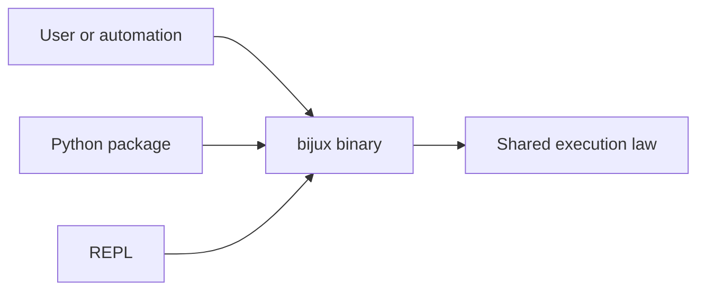
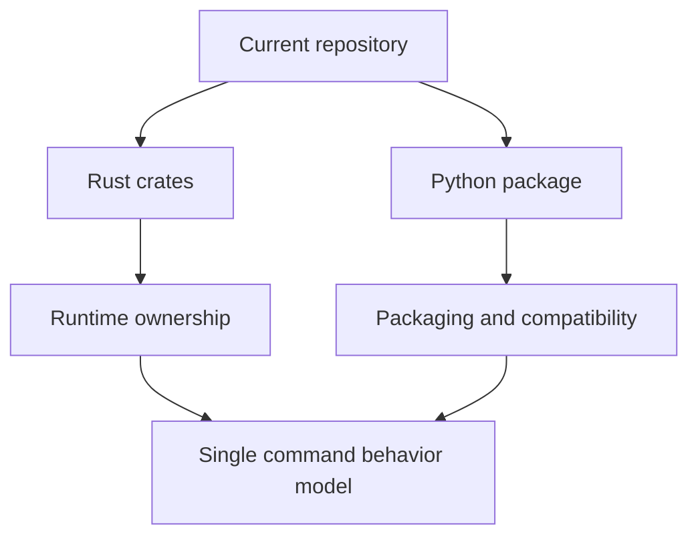

# What Bijux Is

## Core Identity

`bijux-cli` is a command interface with Rust runtime ownership and Python
distribution compatibility. The current system is centered on the Rust binary.
The Python package is a supported way to install and invoke that runtime, not a
second independent implementation.

## What It Optimizes For

- deterministic global flag behavior
- explicit command and output contracts
- plugin management and compatibility surfaces
- machine-readable output for scripts and CI
- one execution model shared by CLI and REPL

## What It Is Not

- not a general-purpose plugin sandbox
- not a Windows-first CLI framework
- not a multi-runtime architecture where Python and Rust diverge by design
- not a promise that every internal crate boundary is stable for downstream use

## Honest Summary

Bijux is strongest when you want a command surface that stays scriptable as it
grows. It is weaker if you need a fully sandboxed extension model or broad
platform support beyond POSIX environments.

## Read Next

- [First Run](first-run.md)
- [Command Model](command-model.md)
- [System Overview](../04-architecture/system-overview.md)
