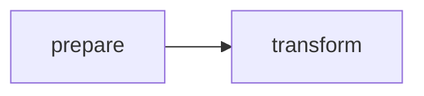

# First Dag

## Purpose
Guide a new user from empty workspace to a valid DAG with explicit execution order.

## Context
This is the first hands-on step after installation.

## Explanation
Use a two-node DAG to make ordering explicit and easy to debug.

Beginner walkthrough:
1. Create a DAG file.
2. Define two nodes.
3. Make node B depend on node A.
4. Run the DAG.
5. Inspect run output.

Beginner mental model:
- A graph is a plan.
- A run is one execution of that plan.
- A dependency edge means "must run after".

Quick start summary:
- Author DAG
- Run DAG
- Inspect run
- Replay if needed
- Diff when behavior changes

Field-level explanation for the first DAG:
- `graph_id`: stable identifier for this graph definition example.
- `nodes`: ordered list of node definitions (ordering in file is authoring order, not execution guarantee by itself).
- `id`: unique node identifier within this graph.
- `command`: shell command executed for the node.
- `depends_on`: list of prerequisite node IDs that must complete first.

Dependency explanation:
- `transform` depends on `prepare`, so scheduler cannot run `transform` before `prepare` succeeds.
- if `prepare` fails, `transform` will not execute in normal dependency-correct mode.

## Examples
```json
{
  "graph_id": "EXAMPLE_GRAPH_001",
  "nodes": [
    {
      "id": "prepare",
      "command": "echo ok > out/input.txt",
      "depends_on": []
    },
    {
      "id": "transform",
      "command": "cat out/input.txt > out/result.txt",
      "depends_on": ["prepare"]
    }
  ]
}
```



```bash
# 1) Save the JSON as ./examples/first.dag.json
# 2) Execute the graph
bijux-dag run --dag ./examples/first.dag.json > run-output.txt

# 3) Read run id from output, then inspect
bijux-dag inspect run --run-id RUN_20260309_001

# 4) Inspect produced artifacts (example command surface)
bijux-dag inspect artifact --run-id RUN_20260309_001
```

```text
Expected artifact outcomes:
- after node "prepare": out/input.txt exists
- after node "transform": out/result.txt exists
```

```text
Execution graph behavior:
- schedulable set at start: [prepare]
- schedulable set after prepare success: [transform]
- terminal state: succeeded (if both commands succeed)
```

## Guarantees
- This tutorial uses explicit dependency ordering.
- Example shape is intentionally minimal and readable.
- The dependency chain produces deterministic ordering for this sample graph.

## Limitations
- Advanced backend/runtime options are out of scope.
- Schema-level constraints are documented in specification docs.

## Related
- `docs/02-getting-started/03-running-a-pipeline.md`
- `docs/02-getting-started/04-understanding-runs.md`
- `docs/03-user-guide/01-authoring-dags.md`
- `docs/06-specification/01-dag-model.md`
