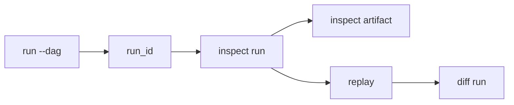

# Running A Pipeline

Explain the default run workflow from execution to replay/diff diagnostics.

This document bridges beginner DAG authoring and operational debugging.

## Explanation
End-to-end beginner workflow:
1. execute a graph and capture the generated run ID.
2. inspect the run to confirm lifecycle status and node outcomes.
3. inspect artifacts for expected outputs.
4. replay baseline run when you need reproducibility confidence.
5. diff baseline and candidate runs when behavior changes.

Command map:
- run: `bijux-dag run --dag <path>`
- inspect run: `bijux-dag inspect run --run-id <id>`
- inspect artifact: `bijux-dag inspect artifact --run-id <id>`
- replay: `bijux-dag replay --run-id <id>`
- diff run: `bijux-dag diff run --left <id> --right <id>`

Run output interpretation:
- run command should emit a run identifier and terminal status.
- inspect should expose node-level outcomes for diagnosis.
- replay and diff should classify equivalence or drift explicitly.

Run directory mental model:
- each run materializes evidence under a run-scoped directory.
- run evidence includes metadata, node outcomes, and artifact references.
- inspect/replay/diff consume this persisted evidence.

Operational sequence rule:
- do not jump to replay/diff before confirming baseline run integrity.
- first confirm run success or failure reason, then compare.

Canonical reference boundaries:
- this guide explains first-run operator flow.
- canonical replay semantics live in `docs/03-user-guide/05-replay.md` and `docs/06-specification/07-replay-semantics.md`.
- canonical diff semantics live in `docs/03-user-guide/06-diff.md` and `docs/06-specification/08-diff-semantics.md`.

## Examples
```bash
# 1) Execute the pipeline
bijux-dag run --dag ./examples/first.dag.json

# Example important output fields (illustrative):
# run_id: RUN_20260309_001
# status: succeeded
# artifacts: 2

# 2) Inspect run state
bijux-dag inspect run --run-id RUN_20260309_001

# 3) Inspect artifacts produced by that run
bijux-dag inspect artifact --run-id RUN_20260309_001

# 4) Replay to validate deterministic behavior
bijux-dag replay --run-id RUN_20260309_001

# 5) Compare baseline and candidate runs
bijux-dag diff run --left RUN_20260309_001 --right RUN_20260309_002
```

```text
Example run directory layout (conceptual):
runs/
  RUN_20260309_001/
    run-metadata.json
    node-results.json
    artifacts-index.json
```



## Guarantees
- This guide documents a coherent first-response run workflow.
- Replay and diff usage are integrated into normal operations, not separate tracks.
- The sequence includes explicit run/output inspection before comparison actions.

## Limitations
- Advanced release/ci lane behavior is not covered.
- Field-level diff classes are specified elsewhere.
- Exact run directory file names may vary by implementation evolution.

## Related
- `docs/02-getting-started/04-understanding-runs.md`
- `docs/02-getting-started/05-basic-troubleshooting.md`
- `docs/03-user-guide/05-replay.md`
- `docs/03-user-guide/06-diff.md`
