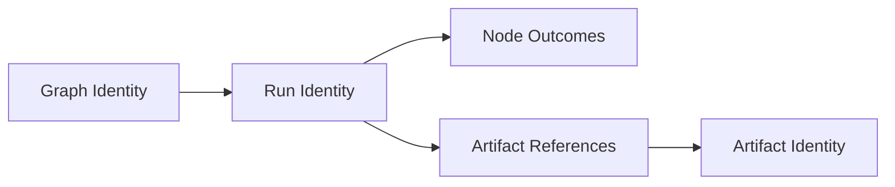

# Understanding Runs

## Purpose
Define the run model a beginner needs for confident execution analysis.

## Context
Run interpretation is required for troubleshooting, replay, and diff.

## Explanation
Run identity fundamentals:
- every run has a unique `run_id`.
- `run_id` identifies one concrete execution instance, even when graph definition is unchanged.
- multiple runs can reference the same graph identity but always have different run identities.

Run metadata model (operator view):
- `run_id`: execution identifier.
- `graph_id`: definition identity used for execution.
- `status`: planned/running/succeeded/failed/canceled (implementation vocabulary may vary in presentation).
- timing data: started/finished timestamps or durations.
- node outcomes: per-node success/failure and diagnostics.
- artifact references: links to produced artifacts and lineage fields.

Beginner mental model:
- graph answers "what should happen."
- run answers "what happened this time."
- artifact answers "what output was produced by which node/run."

Lifecycle behavior:
1. run is created with graph context.
2. scheduler and engine execute nodes according to dependencies.
3. node outcomes and artifact references are persisted.
4. run transitions to terminal state.

Lineage relationship:
- a run links graph identity to node outcomes.
- artifacts link back to the run and producing node.
- replay and diff consume these links for equivalence classification.

Quick run review checklist:
1. capture `run_id` from command output.
2. confirm terminal status.
3. inspect failed/blocked node outcomes.
4. inspect artifact references for missing or unexpected outputs.
5. compare against prior run when behavior changed.

## Examples
```bash
# Inspect full run record
bijux-dag inspect run --run-id RUN_20260309_001

# Inspect associated artifacts
bijux-dag inspect artifact --run-id RUN_20260309_001

# Compare runs when behavior changed
bijux-dag diff run --left RUN_20260309_001 --right RUN_20260309_002
```

```json
{
  "run_id": "RUN_20260309_001",
  "graph_id": "GRAPH_44A",
  "status": "succeeded",
  "nodes": {
    "prepare": {"status": "succeeded"},
    "transform": {"status": "succeeded"}
  },
  "artifacts": [
    {"artifact_id": "ART_001", "node_id": "prepare"},
    {"artifact_id": "ART_002", "node_id": "transform"}
  ]
}
```



## Guarantees
- Run identity and status interpretation are defined consistently with getting-started flow.
- The checklist is sufficient for first-pass diagnostics.
- This guide defines run metadata and lineage concepts needed for replay/diff orientation.

## Limitations
- Backend-specific storage details are not covered here.
- This is an operational guide, not schema contract text.
- Exact JSON fields may differ by output mode or CLI version presentation.

## Related
- `docs/02-getting-started/03-running-a-pipeline.md`
- `docs/02-getting-started/05-basic-troubleshooting.md`
- `docs/03-user-guide/04-run-history.md`
- `docs/06-specification/02-run-model.md`
