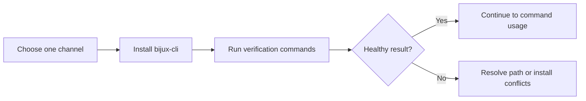
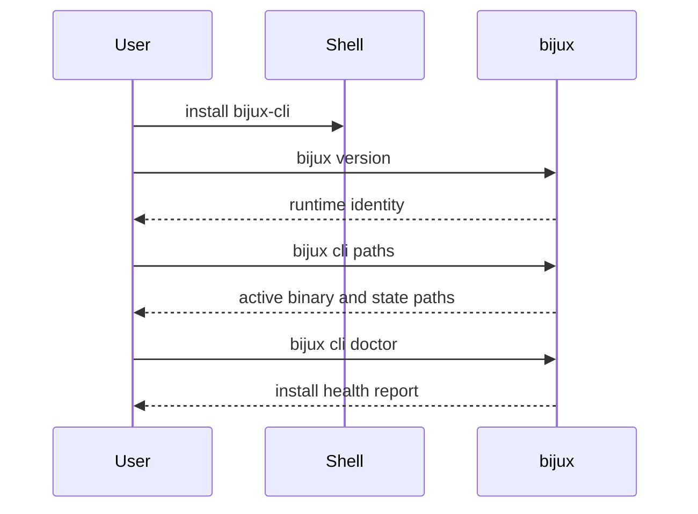

# Install And Verify

## Goal

Choose one installation channel, verify the active runtime immediately, and
avoid carrying ambiguous installs into later automation.





## Recommended Channels

- `cargo install --locked bijux-cli`
- `python -m pip install --upgrade bijux-cli`
- `pipx install bijux-cli`

Pick one. Using several channels at once is possible, but it increases the
chance of path ambiguity and stale wrappers.

## Verify Immediately

Run:

```bash
bijux version
bijux cli paths
bijux cli doctor
```

These commands answer three different questions:

- does `bijux` resolve at all
- which binary and state paths are active
- is the current install healthy or shadowed by another channel

## Honest Rule

Do not treat an install as complete until `bijux cli doctor` is clean enough
for your intended use. A command existing in `PATH` is not the same as a sound
runtime setup.

## Read Next

Continue to [Installation And Recovery](installation-and-recovery.md).
